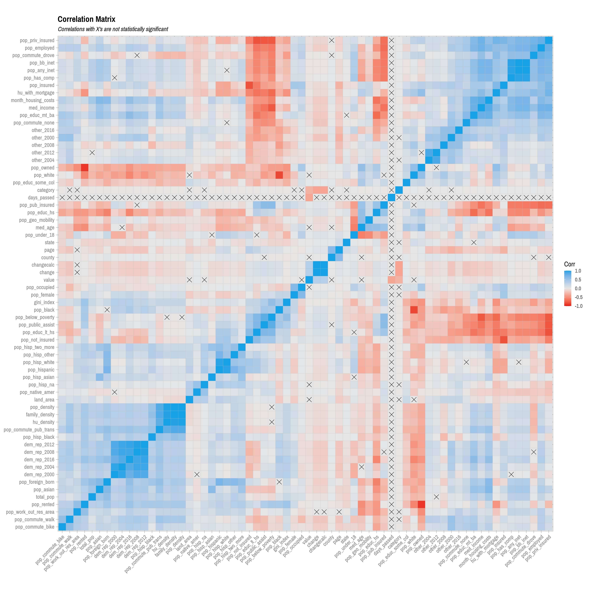
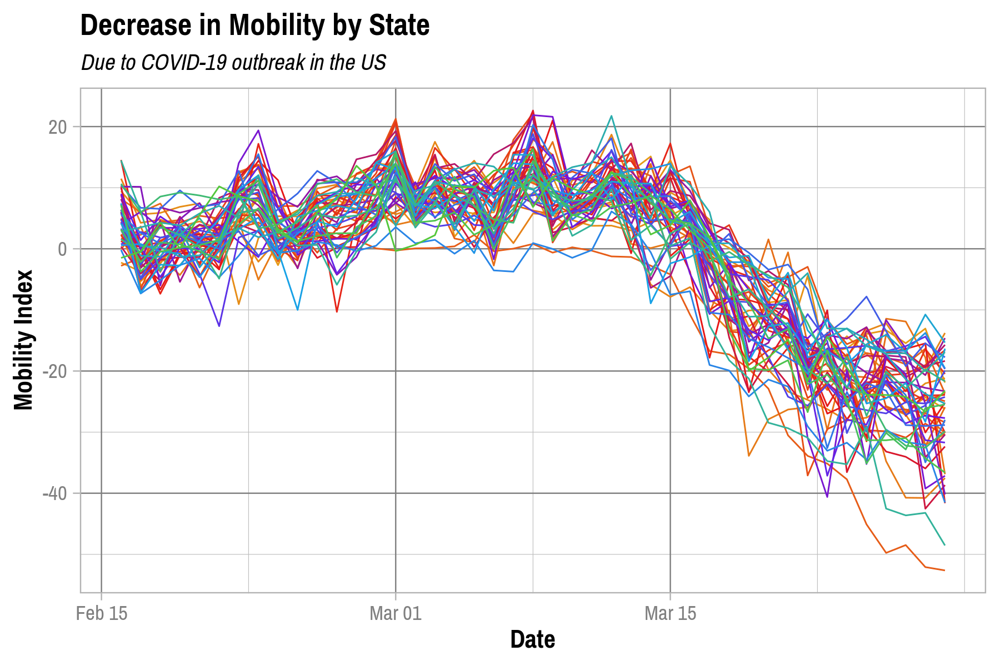

Analysis
================
Adam Shelton
4/5/2020

## Descriptive Statistics

``` r
descr_stats = merged_data %>% select(-geometry, -id) %>% skim() %>% partition()

descr_stats$factor %>% kable()
```

<table>

<thead>

<tr>

<th style="text-align:left;">

skim\_variable

</th>

<th style="text-align:right;">

n\_missing

</th>

<th style="text-align:right;">

complete\_rate

</th>

<th style="text-align:left;">

ordered

</th>

<th style="text-align:right;">

n\_unique

</th>

<th style="text-align:left;">

top\_counts

</th>

</tr>

</thead>

<tbody>

<tr>

<td style="text-align:left;">

state

</td>

<td style="text-align:right;">

0

</td>

<td style="text-align:right;">

1

</td>

<td style="text-align:left;">

FALSE

</td>

<td style="text-align:right;">

51

</td>

<td style="text-align:left;">

Tex: 21925, Geo: 13882, US: 13150, Ohi: 12009

</td>

</tr>

<tr>

<td style="text-align:left;">

county

</td>

<td style="text-align:right;">

0

</td>

<td style="text-align:right;">

1

</td>

<td style="text-align:left;">

FALSE

</td>

<td style="text-align:right;">

1270

</td>

<td style="text-align:left;">

Was: 3096, Jef: 2677, Jac: 2380, Mon: 2300

</td>

</tr>

<tr>

<td style="text-align:left;">

category

</td>

<td style="text-align:right;">

0

</td>

<td style="text-align:right;">

1

</td>

<td style="text-align:left;">

FALSE

</td>

<td style="text-align:right;">

6

</td>

<td style="text-align:left;">

ret: 77318, gro: 74859, wor: 67077, tra: 30982

</td>

</tr>

</tbody>

</table>

``` r
descr_stats$Date %>% kable()
```

<table>

<thead>

<tr>

<th style="text-align:left;">

skim\_variable

</th>

<th style="text-align:right;">

n\_missing

</th>

<th style="text-align:right;">

complete\_rate

</th>

<th style="text-align:left;">

min

</th>

<th style="text-align:left;">

max

</th>

<th style="text-align:left;">

median

</th>

<th style="text-align:right;">

n\_unique

</th>

</tr>

</thead>

<tbody>

<tr>

<td style="text-align:left;">

date

</td>

<td style="text-align:right;">

0

</td>

<td style="text-align:right;">

1

</td>

<td style="text-align:left;">

2020-02-16

</td>

<td style="text-align:left;">

2020-03-29

</td>

<td style="text-align:left;">

2020-03-08

</td>

<td style="text-align:right;">

43

</td>

</tr>

</tbody>

</table>

``` r
descr_stats$numeric %>% kable()
```

<table>

<thead>

<tr>

<th style="text-align:left;">

skim\_variable

</th>

<th style="text-align:right;">

n\_missing

</th>

<th style="text-align:right;">

complete\_rate

</th>

<th style="text-align:right;">

mean

</th>

<th style="text-align:right;">

sd

</th>

<th style="text-align:right;">

p0

</th>

<th style="text-align:right;">

p25

</th>

<th style="text-align:right;">

p50

</th>

<th style="text-align:right;">

p75

</th>

<th style="text-align:right;">

p100

</th>

<th style="text-align:left;">

hist

</th>

</tr>

</thead>

<tbody>

<tr>

<td style="text-align:left;">

page

</td>

<td style="text-align:right;">

0

</td>

<td style="text-align:right;">

1.0000000

</td>

<td style="text-align:right;">

2.211244e+01

</td>

<td style="text-align:right;">

1.862806e+01

</td>

<td style="text-align:right;">

2.0000000

</td>

<td style="text-align:right;">

8.0000000

</td>

<td style="text-align:right;">

18.0000000

</td>

<td style="text-align:right;">

3.000000e+01

</td>

<td style="text-align:right;">

1.090000e+02

</td>

<td style="text-align:left;">

▇▃▁▁▁

</td>

</tr>

<tr>

<td style="text-align:left;">

change

</td>

<td style="text-align:right;">

0

</td>

<td style="text-align:right;">

1.0000000

</td>

<td style="text-align:right;">

\-2.417671e+01

</td>

<td style="text-align:right;">

2.323282e+01

</td>

<td style="text-align:right;">

\-100.0000000

</td>

<td style="text-align:right;">

\-38.0000000

</td>

<td style="text-align:right;">

\-27.0000000

</td>

<td style="text-align:right;">

\-1.300000e+01

</td>

<td style="text-align:right;">

1.670000e+02

</td>

<td style="text-align:left;">

▂▇▁▁▁

</td>

</tr>

<tr>

<td style="text-align:left;">

changecalc

</td>

<td style="text-align:right;">

0

</td>

<td style="text-align:right;">

1.0000000

</td>

<td style="text-align:right;">

\-2.518706e+01

</td>

<td style="text-align:right;">

2.419813e+01

</td>

<td style="text-align:right;">

\-104.1666667

</td>

<td style="text-align:right;">

\-39.4417450

</td>

<td style="text-align:right;">

\-28.4090933

</td>

<td style="text-align:right;">

\-1.345009e+01

</td>

<td style="text-align:right;">

1.736111e+02

</td>

<td style="text-align:left;">

▂▇▁▁▁

</td>

</tr>

<tr>

<td style="text-align:left;">

value

</td>

<td style="text-align:right;">

0

</td>

<td style="text-align:right;">

1.0000000

</td>

<td style="text-align:right;">

\-6.756340e-01

</td>

<td style="text-align:right;">

2.130454e+01

</td>

<td style="text-align:right;">

\-104.1670000

</td>

<td style="text-align:right;">

\-8.3590000

</td>

<td style="text-align:right;">

1.9115000

</td>

<td style="text-align:right;">

9.637000e+00

</td>

<td style="text-align:right;">

3.209300e+02

</td>

<td style="text-align:left;">

▂▇▁▁▁

</td>

</tr>

<tr>

<td style="text-align:left;">

pop\_female

</td>

<td style="text-align:right;">

18579

</td>

<td style="text-align:right;">

0.9368156

</td>

<td style="text-align:right;">

5.032908e-01

</td>

<td style="text-align:right;">

1.745410e-02

</td>

<td style="text-align:right;">

0.3338906

</td>

<td style="text-align:right;">

0.4985429

</td>

<td style="text-align:right;">

0.5062139

</td>

<td style="text-align:right;">

5.124868e-01

</td>

<td style="text-align:right;">

5.503806e-01

</td>

<td style="text-align:left;">

▁▁▁▇▇

</td>

</tr>

<tr>

<td style="text-align:left;">

med\_age

</td>

<td style="text-align:right;">

18579

</td>

<td style="text-align:right;">

0.9368156

</td>

<td style="text-align:right;">

3.998955e+01

</td>

<td style="text-align:right;">

4.910213e+00

</td>

<td style="text-align:right;">

23.4000000

</td>

<td style="text-align:right;">

37.0000000

</td>

<td style="text-align:right;">

39.9000000

</td>

<td style="text-align:right;">

4.270000e+01

</td>

<td style="text-align:right;">

6.700000e+01

</td>

<td style="text-align:left;">

▁▇▆▁▁

</td>

</tr>

<tr>

<td style="text-align:left;">

total\_pop

</td>

<td style="text-align:right;">

18579

</td>

<td style="text-align:right;">

0.9368156

</td>

<td style="text-align:right;">

2.146984e+05

</td>

<td style="text-align:right;">

5.029253e+05

</td>

<td style="text-align:right;">

1605.0000000

</td>

<td style="text-align:right;">

28928.0000000

</td>

<td style="text-align:right;">

58477.0000000

</td>

<td style="text-align:right;">

1.970080e+05

</td>

<td style="text-align:right;">

1.009805e+07

</td>

<td style="text-align:left;">

▇▁▁▁▁

</td>

</tr>

<tr>

<td style="text-align:left;">

pop\_white

</td>

<td style="text-align:right;">

18579

</td>

<td style="text-align:right;">

0.9368156

</td>

<td style="text-align:right;">

8.146528e-01

</td>

<td style="text-align:right;">

1.528040e-01

</td>

<td style="text-align:right;">

0.1587593

</td>

<td style="text-align:right;">

0.7430041

</td>

<td style="text-align:right;">

0.8674380

</td>

<td style="text-align:right;">

9.314013e-01

</td>

<td style="text-align:right;">

9.945276e-01

</td>

<td style="text-align:left;">

▁▁▂▃▇

</td>

</tr>

<tr>

<td style="text-align:left;">

pop\_black

</td>

<td style="text-align:right;">

18579

</td>

<td style="text-align:right;">

0.9368156

</td>

<td style="text-align:right;">

1.002666e-01

</td>

<td style="text-align:right;">

1.343909e-01

</td>

<td style="text-align:right;">

0.0000000

</td>

<td style="text-align:right;">

0.0123136

</td>

<td style="text-align:right;">

0.0425570

</td>

<td style="text-align:right;">

1.264625e-01

</td>

<td style="text-align:right;">

8.260733e-01

</td>

<td style="text-align:left;">

▇▁▁▁▁

</td>

</tr>

<tr>

<td style="text-align:left;">

pop\_native\_amer

</td>

<td style="text-align:right;">

18579

</td>

<td style="text-align:right;">

0.9368156

</td>

<td style="text-align:right;">

1.141450e-02

</td>

<td style="text-align:right;">

3.605690e-02

</td>

<td style="text-align:right;">

0.0000000

</td>

<td style="text-align:right;">

0.0019061

</td>

<td style="text-align:right;">

0.0034937

</td>

<td style="text-align:right;">

6.973900e-03

</td>

<td style="text-align:right;">

6.511424e-01

</td>

<td style="text-align:left;">

▇▁▁▁▁

</td>

</tr>

<tr>

<td style="text-align:left;">

pop\_asian

</td>

<td style="text-align:right;">

18579

</td>

<td style="text-align:right;">

0.9368156

</td>

<td style="text-align:right;">

2.128030e-02

</td>

<td style="text-align:right;">

3.672500e-02

</td>

<td style="text-align:right;">

0.0000000

</td>

<td style="text-align:right;">

0.0050077

</td>

<td style="text-align:right;">

0.0100497

</td>

<td style="text-align:right;">

2.301580e-02

</td>

<td style="text-align:right;">

4.251072e-01

</td>

<td style="text-align:left;">

▇▁▁▁▁

</td>

</tr>

<tr>

<td style="text-align:left;">

pop\_hispanic

</td>

<td style="text-align:right;">

18579

</td>

<td style="text-align:right;">

0.9368156

</td>

<td style="text-align:right;">

1.097607e-01

</td>

<td style="text-align:right;">

1.448708e-01

</td>

<td style="text-align:right;">

0.0010945

</td>

<td style="text-align:right;">

0.0266838

</td>

<td style="text-align:right;">

0.0547423

</td>

<td style="text-align:right;">

1.265328e-01

</td>

<td style="text-align:right;">

9.906877e-01

</td>

<td style="text-align:left;">

▇▁▁▁▁

</td>

</tr>

<tr>

<td style="text-align:left;">

pop\_not\_hisp\_white

</td>

<td style="text-align:right;">

18579

</td>

<td style="text-align:right;">

0.9368156

</td>

<td style="text-align:right;">

7.376609e-01

</td>

<td style="text-align:right;">

1.955944e-01

</td>

<td style="text-align:right;">

0.0072777

</td>

<td style="text-align:right;">

0.6216551

</td>

<td style="text-align:right;">

0.7883597

</td>

<td style="text-align:right;">

8.979231e-01

</td>

<td style="text-align:right;">

9.939585e-01

</td>

<td style="text-align:left;">

▁▁▂▅▇

</td>

</tr>

<tr>

<td style="text-align:left;">

pop\_not\_hisp\_black

</td>

<td style="text-align:right;">

18579

</td>

<td style="text-align:right;">

0.9368156

</td>

<td style="text-align:right;">

9.831580e-02

</td>

<td style="text-align:right;">

1.335721e-01

</td>

<td style="text-align:right;">

0.0000000

</td>

<td style="text-align:right;">

0.0115207

</td>

<td style="text-align:right;">

0.0407724

</td>

<td style="text-align:right;">

1.237288e-01

</td>

<td style="text-align:right;">

8.178335e-01

</td>

<td style="text-align:left;">

▇▁▁▁▁

</td>

</tr>

<tr>

<td style="text-align:left;">

pop\_not\_hisp\_na

</td>

<td style="text-align:right;">

18579

</td>

<td style="text-align:right;">

0.9368156

</td>

<td style="text-align:right;">

1.003760e-02

</td>

<td style="text-align:right;">

3.471200e-02

</td>

<td style="text-align:right;">

0.0000000

</td>

<td style="text-align:right;">

0.0013824

</td>

<td style="text-align:right;">

0.0026070

</td>

<td style="text-align:right;">

5.190000e-03

</td>

<td style="text-align:right;">

6.446456e-01

</td>

<td style="text-align:left;">

▇▁▁▁▁

</td>

</tr>

<tr>

<td style="text-align:left;">

pop\_not\_hisp\_asian

</td>

<td style="text-align:right;">

18579

</td>

<td style="text-align:right;">

0.9368156

</td>

<td style="text-align:right;">

2.096490e-02

</td>

<td style="text-align:right;">

3.620050e-02

</td>

<td style="text-align:right;">

0.0000000

</td>

<td style="text-align:right;">

0.0048976

</td>

<td style="text-align:right;">

0.0097685

</td>

<td style="text-align:right;">

2.274790e-02

</td>

<td style="text-align:right;">

4.148463e-01

</td>

<td style="text-align:left;">

▇▁▁▁▁

</td>

</tr>

<tr>

<td style="text-align:left;">

pop\_not\_hisp\_nh\_pi

</td>

<td style="text-align:right;">

18579

</td>

<td style="text-align:right;">

0.9368156

</td>

<td style="text-align:right;">

1.068400e-03

</td>

<td style="text-align:right;">

5.965100e-03

</td>

<td style="text-align:right;">

0.0000000

</td>

<td style="text-align:right;">

0.0000000

</td>

<td style="text-align:right;">

0.0002458

</td>

<td style="text-align:right;">

6.801000e-04

</td>

<td style="text-align:right;">

1.116170e-01

</td>

<td style="text-align:left;">

▇▁▁▁▁

</td>

</tr>

<tr>

<td style="text-align:left;">

pop\_not\_hisp\_other

</td>

<td style="text-align:right;">

18579

</td>

<td style="text-align:right;">

0.9368156

</td>

<td style="text-align:right;">

1.379000e-03

</td>

<td style="text-align:right;">

1.857600e-03

</td>

<td style="text-align:right;">

0.0000000

</td>

<td style="text-align:right;">

0.0002505

</td>

<td style="text-align:right;">

0.0009076

</td>

<td style="text-align:right;">

1.871300e-03

</td>

<td style="text-align:right;">

2.925230e-02

</td>

<td style="text-align:left;">

▇▁▁▁▁

</td>

</tr>

<tr>

<td style="text-align:left;">

pop\_not\_hisp\_two\_more

</td>

<td style="text-align:right;">

18579

</td>

<td style="text-align:right;">

0.9368156

</td>

<td style="text-align:right;">

2.081260e-02

</td>

<td style="text-align:right;">

1.627490e-02

</td>

<td style="text-align:right;">

0.0000000

</td>

<td style="text-align:right;">

0.0130384

</td>

<td style="text-align:right;">

0.0177549

</td>

<td style="text-align:right;">

2.423970e-02

</td>

<td style="text-align:right;">

2.330136e-01

</td>

<td style="text-align:left;">

▇▁▁▁▁

</td>

</tr>

<tr>

<td style="text-align:left;">

pop\_hisp\_white

</td>

<td style="text-align:right;">

18579

</td>

<td style="text-align:right;">

0.9368156

</td>

<td style="text-align:right;">

7.699180e-02

</td>

<td style="text-align:right;">

1.168838e-01

</td>

<td style="text-align:right;">

0.0000000

</td>

<td style="text-align:right;">

0.0170102

</td>

<td style="text-align:right;">

0.0334041

</td>

<td style="text-align:right;">

8.209270e-02

</td>

<td style="text-align:right;">

9.435315e-01

</td>

<td style="text-align:left;">

▇▁▁▁▁

</td>

</tr>

<tr>

<td style="text-align:left;">

pop\_hisp\_black

</td>

<td style="text-align:right;">

18579

</td>

<td style="text-align:right;">

0.9368156

</td>

<td style="text-align:right;">

1.950800e-03

</td>

<td style="text-align:right;">

3.143800e-03

</td>

<td style="text-align:right;">

0.0000000

</td>

<td style="text-align:right;">

0.0002242

</td>

<td style="text-align:right;">

0.0009899

</td>

<td style="text-align:right;">

2.411300e-03

</td>

<td style="text-align:right;">

4.836870e-02

</td>

<td style="text-align:left;">

▇▁▁▁▁

</td>

</tr>

<tr>

<td style="text-align:left;">

pop\_hisp\_na

</td>

<td style="text-align:right;">

18579

</td>

<td style="text-align:right;">

0.9368156

</td>

<td style="text-align:right;">

1.376900e-03

</td>

<td style="text-align:right;">

2.761600e-03

</td>

<td style="text-align:right;">

0.0000000

</td>

<td style="text-align:right;">

0.0000263

</td>

<td style="text-align:right;">

0.0004897

</td>

<td style="text-align:right;">

1.501900e-03

</td>

<td style="text-align:right;">

3.269590e-02

</td>

<td style="text-align:left;">

▇▁▁▁▁

</td>

</tr>

<tr>

<td style="text-align:left;">

pop\_hisp\_asian

</td>

<td style="text-align:right;">

18579

</td>

<td style="text-align:right;">

0.9368156

</td>

<td style="text-align:right;">

3.154000e-04

</td>

<td style="text-align:right;">

8.786000e-04

</td>

<td style="text-align:right;">

0.0000000

</td>

<td style="text-align:right;">

0.0000000

</td>

<td style="text-align:right;">

0.0000465

</td>

<td style="text-align:right;">

3.381000e-04

</td>

<td style="text-align:right;">

1.833920e-02

</td>

<td style="text-align:left;">

▇▁▁▁▁

</td>

</tr>

<tr>

<td style="text-align:left;">

pop\_hisp\_nh\_pi

</td>

<td style="text-align:right;">

18579

</td>

<td style="text-align:right;">

0.9368156

</td>

<td style="text-align:right;">

1.219000e-04

</td>

<td style="text-align:right;">

6.150000e-04

</td>

<td style="text-align:right;">

0.0000000

</td>

<td style="text-align:right;">

0.0000000

</td>

<td style="text-align:right;">

0.0000000

</td>

<td style="text-align:right;">

8.730000e-05

</td>

<td style="text-align:right;">

1.284040e-02

</td>

<td style="text-align:left;">

▇▁▁▁▁

</td>

</tr>

<tr>

<td style="text-align:left;">

pop\_hisp\_other

</td>

<td style="text-align:right;">

18579

</td>

<td style="text-align:right;">

0.9368156

</td>

<td style="text-align:right;">

2.360380e-02

</td>

<td style="text-align:right;">

3.777370e-02

</td>

<td style="text-align:right;">

0.0000000

</td>

<td style="text-align:right;">

0.0043354

</td>

<td style="text-align:right;">

0.0112868

</td>

<td style="text-align:right;">

2.589830e-02

</td>

<td style="text-align:right;">

5.700959e-01

</td>

<td style="text-align:left;">

▇▁▁▁▁

</td>

</tr>

<tr>

<td style="text-align:left;">

pop\_hisp\_two\_more

</td>

<td style="text-align:right;">

18579

</td>

<td style="text-align:right;">

0.9368156

</td>

<td style="text-align:right;">

5.400000e-03

</td>

<td style="text-align:right;">

6.360900e-03

</td>

<td style="text-align:right;">

0.0000000

</td>

<td style="text-align:right;">

0.0014387

</td>

<td style="text-align:right;">

0.0033653

</td>

<td style="text-align:right;">

7.046600e-03

</td>

<td style="text-align:right;">

6.592490e-02

</td>

<td style="text-align:left;">

▇▁▁▁▁

</td>

</tr>

<tr>

<td style="text-align:left;">

pop\_geo\_mobility

</td>

<td style="text-align:right;">

18706

</td>

<td style="text-align:right;">

0.9363837

</td>

<td style="text-align:right;">

9.888403e-01

</td>

<td style="text-align:right;">

2.893000e-03

</td>

<td style="text-align:right;">

0.9709951

</td>

<td style="text-align:right;">

0.9872961

</td>

<td style="text-align:right;">

0.9889675

</td>

<td style="text-align:right;">

9.906492e-01

</td>

<td style="text-align:right;">

9.976222e-01

</td>

<td style="text-align:left;">

▁▁▂▇▁

</td>

</tr>

<tr>

<td style="text-align:left;">

pop\_commute\_drove

</td>

<td style="text-align:right;">

18706

</td>

<td style="text-align:right;">

0.9363837

</td>

<td style="text-align:right;">

3.980432e-01

</td>

<td style="text-align:right;">

5.062500e-02

</td>

<td style="text-align:right;">

0.0428324

</td>

<td style="text-align:right;">

0.3684827

</td>

<td style="text-align:right;">

0.4022116

</td>

<td style="text-align:right;">

4.344404e-01

</td>

<td style="text-align:right;">

5.267549e-01

</td>

<td style="text-align:left;">

▁▁▁▇▃

</td>

</tr>

<tr>

<td style="text-align:left;">

pop\_commute\_pub\_trans

</td>

<td style="text-align:right;">

18706

</td>

<td style="text-align:right;">

0.9363837

</td>

<td style="text-align:right;">

7.002000e-03

</td>

<td style="text-align:right;">

2.066420e-02

</td>

<td style="text-align:right;">

0.0000000

</td>

<td style="text-align:right;">

0.0007630

</td>

<td style="text-align:right;">

0.0019252

</td>

<td style="text-align:right;">

4.908000e-03

</td>

<td style="text-align:right;">

3.196223e-01

</td>

<td style="text-align:left;">

▇▁▁▁▁

</td>

</tr>

<tr>

<td style="text-align:left;">

pop\_commute\_bike

</td>

<td style="text-align:right;">

18706

</td>

<td style="text-align:right;">

0.9363837

</td>

<td style="text-align:right;">

1.777600e-03

</td>

<td style="text-align:right;">

3.278000e-03

</td>

<td style="text-align:right;">

0.0000000

</td>

<td style="text-align:right;">

0.0002688

</td>

<td style="text-align:right;">

0.0008790

</td>

<td style="text-align:right;">

1.906800e-03

</td>

<td style="text-align:right;">

3.525430e-02

</td>

<td style="text-align:left;">

▇▁▁▁▁

</td>

</tr>

<tr>

<td style="text-align:left;">

pop\_commute\_walk

</td>

<td style="text-align:right;">

18706

</td>

<td style="text-align:right;">

0.9363837

</td>

<td style="text-align:right;">

1.088100e-02

</td>

<td style="text-align:right;">

9.171100e-03

</td>

<td style="text-align:right;">

0.0000000

</td>

<td style="text-align:right;">

0.0053672

</td>

<td style="text-align:right;">

0.0085285

</td>

<td style="text-align:right;">

1.353360e-02

</td>

<td style="text-align:right;">

1.093379e-01

</td>

<td style="text-align:left;">

▇▁▁▁▁

</td>

</tr>

<tr>

<td style="text-align:left;">

pop\_commute\_none

</td>

<td style="text-align:right;">

18706

</td>

<td style="text-align:right;">

0.9363837

</td>

<td style="text-align:right;">

2.008080e-02

</td>

<td style="text-align:right;">

1.079980e-02

</td>

<td style="text-align:right;">

0.0000000

</td>

<td style="text-align:right;">

0.0129190

</td>

<td style="text-align:right;">

0.0184833

</td>

<td style="text-align:right;">

2.522490e-02

</td>

<td style="text-align:right;">

1.971766e-01

</td>

<td style="text-align:left;">

▇▁▁▁▁

</td>

</tr>

<tr>

<td style="text-align:left;">

pop\_work\_out\_res\_area

</td>

<td style="text-align:right;">

18706

</td>

<td style="text-align:right;">

0.9363837

</td>

<td style="text-align:right;">

1.140129e-01

</td>

<td style="text-align:right;">

8.329880e-02

</td>

<td style="text-align:right;">

0.0000000

</td>

<td style="text-align:right;">

0.0537005

</td>

<td style="text-align:right;">

0.0906736

</td>

<td style="text-align:right;">

1.507215e-01

</td>

<td style="text-align:right;">

5.046984e-01

</td>

<td style="text-align:left;">

▇▅▂▁▁

</td>

</tr>

<tr>

<td style="text-align:left;">

pop\_under\_18

</td>

<td style="text-align:right;">

18579

</td>

<td style="text-align:right;">

0.9368156

</td>

<td style="text-align:right;">

1.956189e-01

</td>

<td style="text-align:right;">

2.911890e-02

</td>

<td style="text-align:right;">

0.0593972

</td>

<td style="text-align:right;">

0.1767030

</td>

<td style="text-align:right;">

0.1953755

</td>

<td style="text-align:right;">

2.118857e-01

</td>

<td style="text-align:right;">

3.208195e-01

</td>

<td style="text-align:left;">

▁▂▇▂▁

</td>

</tr>

<tr>

<td style="text-align:left;">

pop\_public\_assist

</td>

<td style="text-align:right;">

18706

</td>

<td style="text-align:right;">

0.9363837

</td>

<td style="text-align:right;">

6.181540e-02

</td>

<td style="text-align:right;">

2.529960e-02

</td>

<td style="text-align:right;">

0.0031053

</td>

<td style="text-align:right;">

0.0442449

</td>

<td style="text-align:right;">

0.0594048

</td>

<td style="text-align:right;">

7.558600e-02

</td>

<td style="text-align:right;">

1.954957e-01

</td>

<td style="text-align:left;">

▃▇▂▁▁

</td>

</tr>

<tr>

<td style="text-align:left;">

pop\_educ\_lt\_hs

</td>

<td style="text-align:right;">

18706

</td>

<td style="text-align:right;">

0.9363837

</td>

<td style="text-align:right;">

8.719820e-02

</td>

<td style="text-align:right;">

3.757430e-02

</td>

<td style="text-align:right;">

0.0131144

</td>

<td style="text-align:right;">

0.0596825

</td>

<td style="text-align:right;">

0.0796487

</td>

<td style="text-align:right;">

1.089052e-01

</td>

<td style="text-align:right;">

3.075951e-01

</td>

<td style="text-align:left;">

▇▇▂▁▁

</td>

</tr>

<tr>

<td style="text-align:left;">

pop\_educ\_hs

</td>

<td style="text-align:right;">

18706

</td>

<td style="text-align:right;">

0.9363837

</td>

<td style="text-align:right;">

2.220228e-01

</td>

<td style="text-align:right;">

5.662240e-02

</td>

<td style="text-align:right;">

0.0605126

</td>

<td style="text-align:right;">

0.1818964

</td>

<td style="text-align:right;">

0.2231969

</td>

<td style="text-align:right;">

2.631042e-01

</td>

<td style="text-align:right;">

3.900505e-01

</td>

<td style="text-align:left;">

▁▅▇▅▁

</td>

</tr>

<tr>

<td style="text-align:left;">

pop\_educ\_some\_col

</td>

<td style="text-align:right;">

18706

</td>

<td style="text-align:right;">

0.9363837

</td>

<td style="text-align:right;">

2.062337e-01

</td>

<td style="text-align:right;">

3.437530e-02

</td>

<td style="text-align:right;">

0.0845287

</td>

<td style="text-align:right;">

0.1838235

</td>

<td style="text-align:right;">

0.2046769

</td>

<td style="text-align:right;">

2.287826e-01

</td>

<td style="text-align:right;">

3.491096e-01

</td>

<td style="text-align:left;">

▁▅▇▂▁

</td>

</tr>

<tr>

<td style="text-align:left;">

pop\_educ\_mt\_ba

</td>

<td style="text-align:right;">

18706

</td>

<td style="text-align:right;">

0.9363837

</td>

<td style="text-align:right;">

1.659917e-01

</td>

<td style="text-align:right;">

7.206100e-02

</td>

<td style="text-align:right;">

0.0446014

</td>

<td style="text-align:right;">

0.1101065

</td>

<td style="text-align:right;">

0.1490637

</td>

<td style="text-align:right;">

2.072582e-01

</td>

<td style="text-align:right;">

5.548246e-01

</td>

<td style="text-align:left;">

▇▆▂▁▁

</td>

</tr>

<tr>

<td style="text-align:left;">

pop\_below\_poverty

</td>

<td style="text-align:right;">

18706

</td>

<td style="text-align:right;">

0.9363837

</td>

<td style="text-align:right;">

1.458465e-01

</td>

<td style="text-align:right;">

5.323910e-02

</td>

<td style="text-align:right;">

0.0344873

</td>

<td style="text-align:right;">

0.1080595

</td>

<td style="text-align:right;">

0.1410518

</td>

<td style="text-align:right;">

1.744489e-01

</td>

<td style="text-align:right;">

3.827439e-01

</td>

<td style="text-align:left;">

▃▇▃▁▁

</td>

</tr>

<tr>

<td style="text-align:left;">

gini\_index

</td>

<td style="text-align:right;">

18706

</td>

<td style="text-align:right;">

0.9363837

</td>

<td style="text-align:right;">

4.491853e-01

</td>

<td style="text-align:right;">

3.266570e-02

</td>

<td style="text-align:right;">

0.3563000

</td>

<td style="text-align:right;">

0.4275000

</td>

<td style="text-align:right;">

0.4475000

</td>

<td style="text-align:right;">

4.688000e-01

</td>

<td style="text-align:right;">

5.971000e-01

</td>

<td style="text-align:left;">

▁▇▆▁▁

</td>

</tr>

<tr>

<td style="text-align:left;">

family\_density

</td>

<td style="text-align:right;">

18706

</td>

<td style="text-align:right;">

0.9363837

</td>

<td style="text-align:right;">

1.040702e+02

</td>

<td style="text-align:right;">

4.334701e+02

</td>

<td style="text-align:right;">

0.1127551

</td>

<td style="text-align:right;">

11.0199010

</td>

<td style="text-align:right;">

23.8881980

</td>

<td style="text-align:right;">

7.505507e+01

</td>

<td style="text-align:right;">

1.007968e+04

</td>

<td style="text-align:left;">

▇▁▁▁▁

</td>

</tr>

<tr>

<td style="text-align:left;">

med\_income

</td>

<td style="text-align:right;">

18706

</td>

<td style="text-align:right;">

0.9363837

</td>

<td style="text-align:right;">

2.776474e+04

</td>

<td style="text-align:right;">

5.900222e+03

</td>

<td style="text-align:right;">

12016.0000000

</td>

<td style="text-align:right;">

23839.0000000

</td>

<td style="text-align:right;">

26833.0000000

</td>

<td style="text-align:right;">

3.072500e+04

</td>

<td style="text-align:right;">

6.708900e+04

</td>

<td style="text-align:left;">

▂▇▁▁▁

</td>

</tr>

<tr>

<td style="text-align:left;">

hu\_density

</td>

<td style="text-align:right;">

18579

</td>

<td style="text-align:right;">

0.9368156

</td>

<td style="text-align:right;">

1.911171e+02

</td>

<td style="text-align:right;">

9.986805e+02

</td>

<td style="text-align:right;">

0.2603855

</td>

<td style="text-align:right;">

20.6437088

</td>

<td style="text-align:right;">

41.7174759

</td>

<td style="text-align:right;">

1.269719e+02

</td>

<td style="text-align:right;">

2.729466e+04

</td>

<td style="text-align:left;">

▇▁▁▁▁

</td>

</tr>

<tr>

<td style="text-align:left;">

pop\_occupied

</td>

<td style="text-align:right;">

18579

</td>

<td style="text-align:right;">

0.9368156

</td>

<td style="text-align:right;">

9.679614e-01

</td>

<td style="text-align:right;">

3.383390e-02

</td>

<td style="text-align:right;">

0.6380996

</td>

<td style="text-align:right;">

0.9628070

</td>

<td style="text-align:right;">

0.9797810

</td>

<td style="text-align:right;">

9.869858e-01

</td>

<td style="text-align:right;">

1.000000e+00

</td>

<td style="text-align:left;">

▁▁▁▁▇

</td>

</tr>

<tr>

<td style="text-align:left;">

pop\_owned

</td>

<td style="text-align:right;">

18579

</td>

<td style="text-align:right;">

0.9368156

</td>

<td style="text-align:right;">

6.846211e-01

</td>

<td style="text-align:right;">

8.554000e-02

</td>

<td style="text-align:right;">

0.1523173

</td>

<td style="text-align:right;">

0.6368628

</td>

<td style="text-align:right;">

0.6935854

</td>

<td style="text-align:right;">

7.458163e-01

</td>

<td style="text-align:right;">

9.039822e-01

</td>

<td style="text-align:left;">

▁▁▂▇▃

</td>

</tr>

<tr>

<td style="text-align:left;">

hu\_with\_mortgage

</td>

<td style="text-align:right;">

18579

</td>

<td style="text-align:right;">

0.9368156

</td>

<td style="text-align:right;">

1.500893e-01

</td>

<td style="text-align:right;">

3.270360e-02

</td>

<td style="text-align:right;">

0.0270365

</td>

<td style="text-align:right;">

0.1288084

</td>

<td style="text-align:right;">

0.1524723

</td>

<td style="text-align:right;">

1.726017e-01

</td>

<td style="text-align:right;">

2.577299e-01

</td>

<td style="text-align:left;">

▁▃▇▅▁

</td>

</tr>

<tr>

<td style="text-align:left;">

pop\_rented

</td>

<td style="text-align:right;">

18579

</td>

<td style="text-align:right;">

0.9368156

</td>

<td style="text-align:right;">

2.833404e-01

</td>

<td style="text-align:right;">

7.780360e-02

</td>

<td style="text-align:right;">

0.0933153

</td>

<td style="text-align:right;">

0.2277659

</td>

<td style="text-align:right;">

0.2745108

</td>

<td style="text-align:right;">

3.280548e-01

</td>

<td style="text-align:right;">

7.702007e-01

</td>

<td style="text-align:left;">

▃▇▂▁▁

</td>

</tr>

<tr>

<td style="text-align:left;">

month\_housing\_costs

</td>

<td style="text-align:right;">

18579

</td>

<td style="text-align:right;">

0.9368156

</td>

<td style="text-align:right;">

8.881965e+02

</td>

<td style="text-align:right;">

3.154834e+02

</td>

<td style="text-align:right;">

367.0000000

</td>

<td style="text-align:right;">

668.0000000

</td>

<td style="text-align:right;">

810.0000000

</td>

<td style="text-align:right;">

1.017000e+03

</td>

<td style="text-align:right;">

2.354000e+03

</td>

<td style="text-align:left;">

▇▇▂▁▁

</td>

</tr>

<tr>

<td style="text-align:left;">

pop\_employed

</td>

<td style="text-align:right;">

18706

</td>

<td style="text-align:right;">

0.9363837

</td>

<td style="text-align:right;">

4.107172e-01

</td>

<td style="text-align:right;">

5.410500e-02

</td>

<td style="text-align:right;">

0.1643981

</td>

<td style="text-align:right;">

0.3740357

</td>

<td style="text-align:right;">

0.4147914

</td>

<td style="text-align:right;">

4.496372e-01

</td>

<td style="text-align:right;">

6.099116e-01

</td>

<td style="text-align:left;">

▁▂▇▆▁

</td>

</tr>

<tr>

<td style="text-align:left;">

pop\_has\_comp

</td>

<td style="text-align:right;">

18579

</td>

<td style="text-align:right;">

0.9368156

</td>

<td style="text-align:right;">

7.271569e-01

</td>

<td style="text-align:right;">

1.085798e-01

</td>

<td style="text-align:right;">

0.2647824

</td>

<td style="text-align:right;">

0.6595720

</td>

<td style="text-align:right;">

0.7434211

</td>

<td style="text-align:right;">

8.085005e-01

</td>

<td style="text-align:right;">

9.466024e-01

</td>

<td style="text-align:left;">

▁▁▃▇▅

</td>

</tr>

<tr>

<td style="text-align:left;">

pop\_any\_inet

</td>

<td style="text-align:right;">

18579

</td>

<td style="text-align:right;">

0.9368156

</td>

<td style="text-align:right;">

6.499554e-01

</td>

<td style="text-align:right;">

1.182410e-01

</td>

<td style="text-align:right;">

0.1760980

</td>

<td style="text-align:right;">

0.5728070

</td>

<td style="text-align:right;">

0.6603899

</td>

<td style="text-align:right;">

7.368450e-01

</td>

<td style="text-align:right;">

9.259180e-01

</td>

<td style="text-align:left;">

▁▂▅▇▂

</td>

</tr>

<tr>

<td style="text-align:left;">

pop\_bb\_inet

</td>

<td style="text-align:right;">

18579

</td>

<td style="text-align:right;">

0.9368156

</td>

<td style="text-align:right;">

6.447627e-01

</td>

<td style="text-align:right;">

1.187978e-01

</td>

<td style="text-align:right;">

0.1741705

</td>

<td style="text-align:right;">

0.5677615

</td>

<td style="text-align:right;">

0.6549646

</td>

<td style="text-align:right;">

7.304062e-01

</td>

<td style="text-align:right;">

9.227503e-01

</td>

<td style="text-align:left;">

▁▂▆▇▂

</td>

</tr>

<tr>

<td style="text-align:left;">

pop\_native\_born

</td>

<td style="text-align:right;">

18579

</td>

<td style="text-align:right;">

0.9368156

</td>

<td style="text-align:right;">

9.364451e-01

</td>

<td style="text-align:right;">

6.720450e-02

</td>

<td style="text-align:right;">

0.4674596

</td>

<td style="text-align:right;">

0.9204162

</td>

<td style="text-align:right;">

0.9597025

</td>

<td style="text-align:right;">

9.803673e-01

</td>

<td style="text-align:right;">

9.991598e-01

</td>

<td style="text-align:left;">

▁▁▁▁▇

</td>

</tr>

<tr>

<td style="text-align:left;">

pop\_foreign\_born

</td>

<td style="text-align:right;">

18579

</td>

<td style="text-align:right;">

0.9368156

</td>

<td style="text-align:right;">

6.355490e-02

</td>

<td style="text-align:right;">

6.720450e-02

</td>

<td style="text-align:right;">

0.0008402

</td>

<td style="text-align:right;">

0.0196327

</td>

<td style="text-align:right;">

0.0402975

</td>

<td style="text-align:right;">

7.958380e-02

</td>

<td style="text-align:right;">

5.325404e-01

</td>

<td style="text-align:left;">

▇▁▁▁▁

</td>

</tr>

<tr>

<td style="text-align:left;">

pop\_insured

</td>

<td style="text-align:right;">

18579

</td>

<td style="text-align:right;">

0.9368156

</td>

<td style="text-align:right;">

8.840536e-01

</td>

<td style="text-align:right;">

5.466070e-02

</td>

<td style="text-align:right;">

0.5250302

</td>

<td style="text-align:right;">

0.8569067

</td>

<td style="text-align:right;">

0.8942062

</td>

<td style="text-align:right;">

9.238412e-01

</td>

<td style="text-align:right;">

9.681904e-01

</td>

<td style="text-align:left;">

▁▁▁▅▇

</td>

</tr>

<tr>

<td style="text-align:left;">

pop\_priv\_insured

</td>

<td style="text-align:right;">

18579

</td>

<td style="text-align:right;">

0.9368156

</td>

<td style="text-align:right;">

6.516570e-01

</td>

<td style="text-align:right;">

9.610890e-02

</td>

<td style="text-align:right;">

0.2627790

</td>

<td style="text-align:right;">

0.5916799

</td>

<td style="text-align:right;">

0.6582101

</td>

<td style="text-align:right;">

7.201036e-01

</td>

<td style="text-align:right;">

9.036282e-01

</td>

<td style="text-align:left;">

▁▂▆▇▂

</td>

</tr>

<tr>

<td style="text-align:left;">

pop\_pub\_insured

</td>

<td style="text-align:right;">

18579

</td>

<td style="text-align:right;">

0.9368156

</td>

<td style="text-align:right;">

3.669438e-01

</td>

<td style="text-align:right;">

8.218090e-02

</td>

<td style="text-align:right;">

0.1419913

</td>

<td style="text-align:right;">

0.3107980

</td>

<td style="text-align:right;">

0.3642190

</td>

<td style="text-align:right;">

4.203201e-01

</td>

<td style="text-align:right;">

6.666912e-01

</td>

<td style="text-align:left;">

▁▇▇▂▁

</td>

</tr>

<tr>

<td style="text-align:left;">

pop\_not\_insured

</td>

<td style="text-align:right;">

18579

</td>

<td style="text-align:right;">

0.9368156

</td>

<td style="text-align:right;">

9.371120e-02

</td>

<td style="text-align:right;">

4.430140e-02

</td>

<td style="text-align:right;">

0.0197379

</td>

<td style="text-align:right;">

0.0587676

</td>

<td style="text-align:right;">

0.0871872

</td>

<td style="text-align:right;">

1.174194e-01

</td>

<td style="text-align:right;">

3.900159e-01

</td>

<td style="text-align:left;">

▇▅▁▁▁

</td>

</tr>

<tr>

<td style="text-align:left;">

land\_area

</td>

<td style="text-align:right;">

18579

</td>

<td style="text-align:right;">

0.9368156

</td>

<td style="text-align:right;">

1.050025e+03

</td>

<td style="text-align:right;">

1.610443e+03

</td>

<td style="text-align:right;">

26.0150696

</td>

<td style="text-align:right;">

464.4457165

</td>

<td style="text-align:right;">

648.4795288

</td>

<td style="text-align:right;">

9.447897e+02

</td>

<td style="text-align:right;">

2.010567e+04

</td>

<td style="text-align:left;">

▇▁▁▁▁

</td>

</tr>

<tr>

<td style="text-align:left;">

pop\_density

</td>

<td style="text-align:right;">

18579

</td>

<td style="text-align:right;">

0.9368156

</td>

<td style="text-align:right;">

4.438137e+02

</td>

<td style="text-align:right;">

2.073321e+03

</td>

<td style="text-align:right;">

0.5876374

</td>

<td style="text-align:right;">

43.3923836

</td>

<td style="text-align:right;">

92.2823684

</td>

<td style="text-align:right;">

2.925846e+02

</td>

<td style="text-align:right;">

5.096786e+04

</td>

<td style="text-align:left;">

▇▁▁▁▁

</td>

</tr>

<tr>

<td style="text-align:left;">

democrat\_2000

</td>

<td style="text-align:right;">

25990

</td>

<td style="text-align:right;">

0.9116119

</td>

<td style="text-align:right;">

4.225985e-01

</td>

<td style="text-align:right;">

1.091692e-01

</td>

<td style="text-align:right;">

0.0909699

</td>

<td style="text-align:right;">

0.3481819

</td>

<td style="text-align:right;">

0.4190943

</td>

<td style="text-align:right;">

4.896360e-01

</td>

<td style="text-align:right;">

1.012823e+00

</td>

<td style="text-align:left;">

▁▇▅▁▁

</td>

</tr>

<tr>

<td style="text-align:left;">

democrat\_2004

</td>

<td style="text-align:right;">

25820

</td>

<td style="text-align:right;">

0.9121900

</td>

<td style="text-align:right;">

4.114839e-01

</td>

<td style="text-align:right;">

1.211320e-01

</td>

<td style="text-align:right;">

0.0709805

</td>

<td style="text-align:right;">

0.3264823

</td>

<td style="text-align:right;">

0.4050328

</td>

<td style="text-align:right;">

4.881362e-01

</td>

<td style="text-align:right;">

1.071707e+00

</td>

<td style="text-align:left;">

▂▇▃▁▁

</td>

</tr>

<tr>

<td style="text-align:left;">

democrat\_2008

</td>

<td style="text-align:right;">

25820

</td>

<td style="text-align:right;">

0.9121900

</td>

<td style="text-align:right;">

4.469060e-01

</td>

<td style="text-align:right;">

1.365889e-01

</td>

<td style="text-align:right;">

0.1182732

</td>

<td style="text-align:right;">

0.3474429

</td>

<td style="text-align:right;">

0.4388536

</td>

<td style="text-align:right;">

5.374507e-01

</td>

<td style="text-align:right;">

1.222965e+00

</td>

<td style="text-align:left;">

▃▇▂▁▁

</td>

</tr>

<tr>

<td style="text-align:left;">

democrat\_2012

</td>

<td style="text-align:right;">

25820

</td>

<td style="text-align:right;">

0.9121900

</td>

<td style="text-align:right;">

4.190911e-01

</td>

<td style="text-align:right;">

1.453913e-01

</td>

<td style="text-align:right;">

0.0577297

</td>

<td style="text-align:right;">

0.3115267

</td>

<td style="text-align:right;">

0.4072199

</td>

<td style="text-align:right;">

5.145507e-01

</td>

<td style="text-align:right;">

1.195633e+00

</td>

<td style="text-align:left;">

▃▇▃▁▁

</td>

</tr>

<tr>

<td style="text-align:left;">

democrat\_2016

</td>

<td style="text-align:right;">

25820

</td>

<td style="text-align:right;">

0.9121900

</td>

<td style="text-align:right;">

3.610461e-01

</td>

<td style="text-align:right;">

1.564938e-01

</td>

<td style="text-align:right;">

0.0700127

</td>

<td style="text-align:right;">

0.2376614

</td>

<td style="text-align:right;">

0.3358277

</td>

<td style="text-align:right;">

4.602302e-01

</td>

<td style="text-align:right;">

1.256696e+00

</td>

<td style="text-align:left;">

▇▇▂▁▁

</td>

</tr>

<tr>

<td style="text-align:left;">

other\_2000

</td>

<td style="text-align:right;">

25990

</td>

<td style="text-align:right;">

0.9116119

</td>

<td style="text-align:right;">

3.317280e-02

</td>

<td style="text-align:right;">

2.204290e-02

</td>

<td style="text-align:right;">

0.0018151

</td>

<td style="text-align:right;">

0.0178908

</td>

<td style="text-align:right;">

0.0273770

</td>

<td style="text-align:right;">

4.212000e-02

</td>

<td style="text-align:right;">

1.903816e-01

</td>

<td style="text-align:left;">

▇▂▁▁▁

</td>

</tr>

<tr>

<td style="text-align:left;">

other\_2004

</td>

<td style="text-align:right;">

25820

</td>

<td style="text-align:right;">

0.9121900

</td>

<td style="text-align:right;">

1.072190e-02

</td>

<td style="text-align:right;">

1.050600e-02

</td>

<td style="text-align:right;">

0.0000000

</td>

<td style="text-align:right;">

0.0055840

</td>

<td style="text-align:right;">

0.0079362

</td>

<td style="text-align:right;">

1.231570e-02

</td>

<td style="text-align:right;">

8.166410e-02

</td>

<td style="text-align:left;">

▇▁▁▁▁

</td>

</tr>

<tr>

<td style="text-align:left;">

other\_2008

</td>

<td style="text-align:right;">

25820

</td>

<td style="text-align:right;">

0.9121900

</td>

<td style="text-align:right;">

1.486830e-02

</td>

<td style="text-align:right;">

7.904800e-03

</td>

<td style="text-align:right;">

0.0000000

</td>

<td style="text-align:right;">

0.0093622

</td>

<td style="text-align:right;">

0.0143736

</td>

<td style="text-align:right;">

1.906470e-02

</td>

<td style="text-align:right;">

1.289862e-01

</td>

<td style="text-align:left;">

▇▁▁▁▁

</td>

</tr>

<tr>

<td style="text-align:left;">

other\_2012

</td>

<td style="text-align:right;">

25820

</td>

<td style="text-align:right;">

0.9121900

</td>

<td style="text-align:right;">

2.006020e-02

</td>

<td style="text-align:right;">

1.576030e-02

</td>

<td style="text-align:right;">

0.0000000

</td>

<td style="text-align:right;">

0.0119145

</td>

<td style="text-align:right;">

0.0167256

</td>

<td style="text-align:right;">

2.385010e-02

</td>

<td style="text-align:right;">

1.204664e-01

</td>

<td style="text-align:left;">

▇▂▁▁▁

</td>

</tr>

<tr>

<td style="text-align:left;">

other\_2016

</td>

<td style="text-align:right;">

25820

</td>

<td style="text-align:right;">

0.9121900

</td>

<td style="text-align:right;">

5.393770e-02

</td>

<td style="text-align:right;">

3.055050e-02

</td>

<td style="text-align:right;">

0.0059426

</td>

<td style="text-align:right;">

0.0345134

</td>

<td style="text-align:right;">

0.0493601

</td>

<td style="text-align:right;">

6.739390e-02

</td>

<td style="text-align:right;">

3.565006e-01

</td>

<td style="text-align:left;">

▇▂▁▁▁

</td>

</tr>

<tr>

<td style="text-align:left;">

republican\_2000

</td>

<td style="text-align:right;">

25990

</td>

<td style="text-align:right;">

0.9116119

</td>

<td style="text-align:right;">

5.458218e-01

</td>

<td style="text-align:right;">

1.144351e-01

</td>

<td style="text-align:right;">

0.1176602

</td>

<td style="text-align:right;">

0.4762538

</td>

<td style="text-align:right;">

0.5485589

</td>

<td style="text-align:right;">

6.235755e-01

</td>

<td style="text-align:right;">

1.178556e+00

</td>

<td style="text-align:left;">

▁▇▇▁▁

</td>

</tr>

<tr>

<td style="text-align:left;">

republican\_2004

</td>

<td style="text-align:right;">

25820

</td>

<td style="text-align:right;">

0.9121900

</td>

<td style="text-align:right;">

5.793861e-01

</td>

<td style="text-align:right;">

1.226176e-01

</td>

<td style="text-align:right;">

0.1527130

</td>

<td style="text-align:right;">

0.5009595

</td>

<td style="text-align:right;">

0.5860599

</td>

<td style="text-align:right;">

6.654373e-01

</td>

<td style="text-align:right;">

1.277231e+00

</td>

<td style="text-align:left;">

▁▇▇▁▁

</td>

</tr>

<tr>

<td style="text-align:left;">

republican\_2008

</td>

<td style="text-align:right;">

25820

</td>

<td style="text-align:right;">

0.9121900

</td>

<td style="text-align:right;">

5.398176e-01

</td>

<td style="text-align:right;">

1.356420e-01

</td>

<td style="text-align:right;">

0.1038243

</td>

<td style="text-align:right;">

0.4484183

</td>

<td style="text-align:right;">

0.5461068

</td>

<td style="text-align:right;">

6.368000e-01

</td>

<td style="text-align:right;">

1.229101e+00

</td>

<td style="text-align:left;">

▁▇▇▁▁

</td>

</tr>

<tr>

<td style="text-align:left;">

republican\_2012

</td>

<td style="text-align:right;">

25820

</td>

<td style="text-align:right;">

0.9121900

</td>

<td style="text-align:right;">

5.624407e-01

</td>

<td style="text-align:right;">

1.466784e-01

</td>

<td style="text-align:right;">

0.0719343

</td>

<td style="text-align:right;">

0.4629893

</td>

<td style="text-align:right;">

0.5731339

</td>

<td style="text-align:right;">

6.710794e-01

</td>

<td style="text-align:right;">

1.257251e+00

</td>

<td style="text-align:left;">

▁▆▇▁▁

</td>

</tr>

<tr>

<td style="text-align:left;">

republican\_2016

</td>

<td style="text-align:right;">

25820

</td>

<td style="text-align:right;">

0.9121900

</td>

<td style="text-align:right;">

5.856374e-01

</td>

<td style="text-align:right;">

1.595411e-01

</td>

<td style="text-align:right;">

0.0840478

</td>

<td style="text-align:right;">

0.4767649

</td>

<td style="text-align:right;">

0.6076816

</td>

<td style="text-align:right;">

7.120680e-01

</td>

<td style="text-align:right;">

8.947930e-01

</td>

<td style="text-align:left;">

▁▂▆▇▃

</td>

</tr>

</tbody>

</table>

``` r
merged_data %>% select(-geometry, -id) %>% mutate_all(as.numeric) %>% {ggcorrplot(cor(., use = "pairwise.complete.obs"), p.mat = cor_pmat(., use = "pairwise.complete.obs"), hc.order = TRUE, insig = "pch", lab = FALSE, colors = color_pal(3, "segmented"))} + theme_day(base_family = "Pragati Narrow", base_size = 18) + theme(axis.text.x = element_text(angle = 45, hjust = 1), axis.title = element_blank())
```

<!-- -->

### Test Plots

``` r
merged_data %>% filter(state == "New York", category == "workplace") %>% ggplot(aes(x = date, y = value, color = county)) + geom_line() + scale_color_manual(values = color_pal(47)) + theme_day(base_family = "Pragati Narrow", base_size = 18) + theme(legend.position = "none") + labs(title = "Decrease in Workplace Mobility Among New York Counties", subtitle = "Due to COVID-19 outbreak in the US", x = "Date", y = "Mobility Index")
```

<!-- -->

``` r
merged_data %>% select(state, date, value) %>% group_by(state, date) %>% summarise(value = mean(value)) %>% ggplot(aes(x = date, y = value, color = state)) + geom_line() + scale_color_manual(values = color_pal(51)) + theme_day(base_family = "Pragati Narrow", base_size = 18) + theme(legend.position = "none") + labs(title = "Decrease in Mobility by State", subtitle = "Due to COVID-19 outbreak in the US", x = "Date", y = "Mobility Index")
```

<!-- -->

``` r
merged_data %>% select(category, date, value) %>% group_by(category, date) %>% summarise(value = mean(value)) %>% ggplot(aes(x = date, y = value, color = category)) + geom_line(size = 1.5) + scale_color_manual(values = color_pal(6)) + theme_day(base_family = "Pragati Narrow", base_size = 18) + labs(title = "Changes in Mobility by Category", subtitle = "Due to COVID-19 outbreak in the US", x = "Date", y = "Mobility Index")
```

<!-- -->

## Models

### Random Forest
