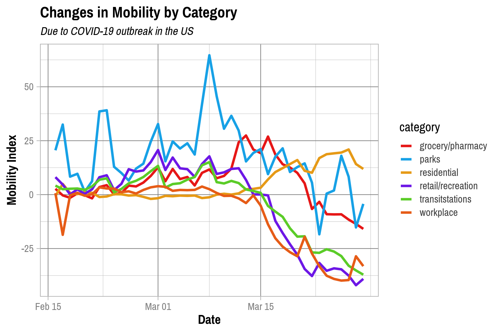
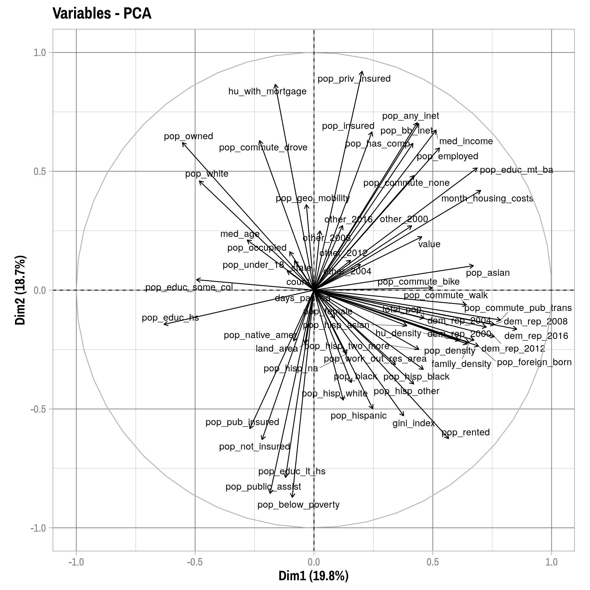

Analysis
================
Adam Shelton
4/5/2020

## Descriptive Statistics

``` r
descr_stats = merged_data %>% select(-geometry, -id) %>% skim() %>% partition()

descr_stats$factor %>% mutate_if(is.numeric, format_number) %>% kable()
```

<table>

<thead>

<tr>

<th style="text-align:left;">

skim\_variable

</th>

<th style="text-align:left;">

n\_missing

</th>

<th style="text-align:left;">

complete\_rate

</th>

<th style="text-align:left;">

ordered

</th>

<th style="text-align:left;">

n\_unique

</th>

<th style="text-align:left;">

top\_counts

</th>

</tr>

</thead>

<tbody>

<tr>

<td style="text-align:left;">

state

</td>

<td style="text-align:left;">

0

</td>

<td style="text-align:left;">

1

</td>

<td style="text-align:left;">

FALSE

</td>

<td style="text-align:left;">

50

</td>

<td style="text-align:left;">

Tex: 21925, Geo: 13882, Ohi: 12009, Vir: 11949

</td>

</tr>

<tr>

<td style="text-align:left;">

county

</td>

<td style="text-align:left;">

0

</td>

<td style="text-align:left;">

1

</td>

<td style="text-align:left;">

FALSE

</td>

<td style="text-align:left;">

1,219

</td>

<td style="text-align:left;">

Was: 3096, Jef: 2677, Jac: 2380, Mon: 2300

</td>

</tr>

<tr>

<td style="text-align:left;">

category

</td>

<td style="text-align:left;">

0

</td>

<td style="text-align:left;">

1

</td>

<td style="text-align:left;">

FALSE

</td>

<td style="text-align:left;">

6

</td>

<td style="text-align:left;">

ret: 75125, gro: 72668, wor: 64886, tra:
28791

</td>

</tr>

</tbody>

</table>

``` r
descr_stats$Date %>% mutate_if(is.numeric, format_number) %>% kable()
```

<table>

<thead>

<tr>

<th style="text-align:left;">

skim\_variable

</th>

<th style="text-align:left;">

n\_missing

</th>

<th style="text-align:left;">

complete\_rate

</th>

<th style="text-align:left;">

min

</th>

<th style="text-align:left;">

max

</th>

<th style="text-align:left;">

median

</th>

<th style="text-align:left;">

n\_unique

</th>

</tr>

</thead>

<tbody>

<tr>

<td style="text-align:left;">

date

</td>

<td style="text-align:left;">

0

</td>

<td style="text-align:left;">

1

</td>

<td style="text-align:left;">

2020-02-16

</td>

<td style="text-align:left;">

2020-03-29

</td>

<td style="text-align:left;">

2020-03-08

</td>

<td style="text-align:left;">

43

</td>

</tr>

</tbody>

</table>

``` r
descr_stats$numeric %>% mutate_if(is.numeric, format_number) %>% kable()
```

<table>

<thead>

<tr>

<th style="text-align:left;">

skim\_variable

</th>

<th style="text-align:left;">

n\_missing

</th>

<th style="text-align:left;">

complete\_rate

</th>

<th style="text-align:left;">

mean

</th>

<th style="text-align:left;">

sd

</th>

<th style="text-align:left;">

p0

</th>

<th style="text-align:left;">

p25

</th>

<th style="text-align:left;">

p50

</th>

<th style="text-align:left;">

p75

</th>

<th style="text-align:left;">

p100

</th>

<th style="text-align:left;">

hist

</th>

</tr>

</thead>

<tbody>

<tr>

<td style="text-align:left;">

page

</td>

<td style="text-align:left;">

0

</td>

<td style="text-align:left;">

1

</td>

<td style="text-align:left;">

22.5

</td>

<td style="text-align:left;">

18.9

</td>

<td style="text-align:left;">

2

</td>

<td style="text-align:left;">

8

</td>

<td style="text-align:left;">

18

</td>

<td style="text-align:left;">

31

</td>

<td style="text-align:left;">

109

</td>

<td style="text-align:left;">

▇▃▁▁▁

</td>

</tr>

<tr>

<td style="text-align:left;">

change

</td>

<td style="text-align:left;">

0

</td>

<td style="text-align:left;">

1

</td>

<td style="text-align:left;">

\-24.284

</td>

<td style="text-align:left;">

22.7

</td>

<td style="text-align:left;">

\-100

</td>

<td style="text-align:left;">

\-38

</td>

<td style="text-align:left;">

\-27

</td>

<td style="text-align:left;">

\-13

</td>

<td style="text-align:left;">

167

</td>

<td style="text-align:left;">

▁▇▁▁▁

</td>

</tr>

<tr>

<td style="text-align:left;">

changecalc

</td>

<td style="text-align:left;">

0

</td>

<td style="text-align:left;">

1

</td>

<td style="text-align:left;">

\-25.298

</td>

<td style="text-align:left;">

23.7

</td>

<td style="text-align:left;">

\-104.167

</td>

<td style="text-align:left;">

\-39.291

</td>

<td style="text-align:left;">

\-28.271

</td>

<td style="text-align:left;">

\-13.686

</td>

<td style="text-align:left;">

174

</td>

<td style="text-align:left;">

▁▇▁▁▁

</td>

</tr>

<tr>

<td style="text-align:left;">

value

</td>

<td style="text-align:left;">

0

</td>

<td style="text-align:left;">

1

</td>

<td style="text-align:left;">

\-0.697

</td>

<td style="text-align:left;">

21.2

</td>

<td style="text-align:left;">

\-104.167

</td>

<td style="text-align:left;">

\-8.483

</td>

<td style="text-align:left;">

1.92

</td>

<td style="text-align:left;">

9.68

</td>

<td style="text-align:left;">

321

</td>

<td style="text-align:left;">

▂▇▁▁▁

</td>

</tr>

<tr>

<td style="text-align:left;">

days\_passed

</td>

<td style="text-align:left;">

0

</td>

<td style="text-align:left;">

1

</td>

<td style="text-align:left;">

21.1

</td>

<td style="text-align:left;">

12.4

</td>

<td style="text-align:left;">

0

</td>

<td style="text-align:left;">

10

</td>

<td style="text-align:left;">

21

</td>

<td style="text-align:left;">

32

</td>

<td style="text-align:left;">

42

</td>

<td style="text-align:left;">

▇▇▇▇▇

</td>

</tr>

<tr>

<td style="text-align:left;">

pop\_female

</td>

<td style="text-align:left;">

0

</td>

<td style="text-align:left;">

1

</td>

<td style="text-align:left;">

0.504

</td>

<td style="text-align:left;">

0.018

</td>

<td style="text-align:left;">

0.334

</td>

<td style="text-align:left;">

0.499

</td>

<td style="text-align:left;">

0.506

</td>

<td style="text-align:left;">

0.513

</td>

<td style="text-align:left;">

0.56

</td>

<td style="text-align:left;">

▁▁▁▇▂

</td>

</tr>

<tr>

<td style="text-align:left;">

med\_age

</td>

<td style="text-align:left;">

0

</td>

<td style="text-align:left;">

1

</td>

<td style="text-align:left;">

39.9

</td>

<td style="text-align:left;">

4.91

</td>

<td style="text-align:left;">

23.4

</td>

<td style="text-align:left;">

36.9

</td>

<td style="text-align:left;">

39.8

</td>

<td style="text-align:left;">

42.6

</td>

<td style="text-align:left;">

67

</td>

<td style="text-align:left;">

▁▇▆▁▁

</td>

</tr>

<tr>

<td style="text-align:left;">

total\_pop

</td>

<td style="text-align:left;">

0

</td>

<td style="text-align:left;">

1

</td>

<td style="text-align:left;">

213,428

</td>

<td style="text-align:left;">

498,616

</td>

<td style="text-align:left;">

1,605

</td>

<td style="text-align:left;">

28,645

</td>

<td style="text-align:left;">

58,538

</td>

<td style="text-align:left;">

197,661

</td>

<td style="text-align:left;">

10,098,052

</td>

<td style="text-align:left;">

▇▁▁▁▁

</td>

</tr>

<tr>

<td style="text-align:left;">

pop\_white

</td>

<td style="text-align:left;">

0

</td>

<td style="text-align:left;">

1

</td>

<td style="text-align:left;">

0.811

</td>

<td style="text-align:left;">

0.156

</td>

<td style="text-align:left;">

0.159

</td>

<td style="text-align:left;">

0.732

</td>

<td style="text-align:left;">

0.864

</td>

<td style="text-align:left;">

0.93

</td>

<td style="text-align:left;">

0.995

</td>

<td style="text-align:left;">

▁▁▂▃▇

</td>

</tr>

<tr>

<td style="text-align:left;">

pop\_black

</td>

<td style="text-align:left;">

0

</td>

<td style="text-align:left;">

1

</td>

<td style="text-align:left;">

0.104

</td>

<td style="text-align:left;">

0.139

</td>

<td style="text-align:left;">

0

</td>

<td style="text-align:left;">

0.013

</td>

<td style="text-align:left;">

0.044

</td>

<td style="text-align:left;">

0.132

</td>

<td style="text-align:left;">

0.826

</td>

<td style="text-align:left;">

▇▁▁▁▁

</td>

</tr>

<tr>

<td style="text-align:left;">

pop\_native\_amer

</td>

<td style="text-align:left;">

0

</td>

<td style="text-align:left;">

1

</td>

<td style="text-align:left;">

0.011

</td>

<td style="text-align:left;">

0.036

</td>

<td style="text-align:left;">

0

</td>

<td style="text-align:left;">

0.002

</td>

<td style="text-align:left;">

0.003

</td>

<td style="text-align:left;">

0.007

</td>

<td style="text-align:left;">

0.651

</td>

<td style="text-align:left;">

▇▁▁▁▁

</td>

</tr>

<tr>

<td style="text-align:left;">

pop\_asian

</td>

<td style="text-align:left;">

0

</td>

<td style="text-align:left;">

1

</td>

<td style="text-align:left;">

0.022

</td>

<td style="text-align:left;">

0.037

</td>

<td style="text-align:left;">

0

</td>

<td style="text-align:left;">

0.005

</td>

<td style="text-align:left;">

0.01

</td>

<td style="text-align:left;">

0.024

</td>

<td style="text-align:left;">

0.425

</td>

<td style="text-align:left;">

▇▁▁▁▁

</td>

</tr>

<tr>

<td style="text-align:left;">

pop\_hispanic

</td>

<td style="text-align:left;">

0

</td>

<td style="text-align:left;">

1

</td>

<td style="text-align:left;">

0.11

</td>

<td style="text-align:left;">

0.145

</td>

<td style="text-align:left;">

0.001

</td>

<td style="text-align:left;">

0.027

</td>

<td style="text-align:left;">

0.055

</td>

<td style="text-align:left;">

0.125

</td>

<td style="text-align:left;">

0.991

</td>

<td style="text-align:left;">

▇▁▁▁▁

</td>

</tr>

<tr>

<td style="text-align:left;">

pop\_hisp\_white

</td>

<td style="text-align:left;">

0

</td>

<td style="text-align:left;">

1

</td>

<td style="text-align:left;">

0.077

</td>

<td style="text-align:left;">

0.117

</td>

<td style="text-align:left;">

0

</td>

<td style="text-align:left;">

0.017

</td>

<td style="text-align:left;">

0.034

</td>

<td style="text-align:left;">

0.081

</td>

<td style="text-align:left;">

0.944

</td>

<td style="text-align:left;">

▇▁▁▁▁

</td>

</tr>

<tr>

<td style="text-align:left;">

pop\_hisp\_black

</td>

<td style="text-align:left;">

0

</td>

<td style="text-align:left;">

1

</td>

<td style="text-align:left;">

0.002

</td>

<td style="text-align:left;">

0.003

</td>

<td style="text-align:left;">

0

</td>

<td style="text-align:left;">

0

</td>

<td style="text-align:left;">

0.001

</td>

<td style="text-align:left;">

0.003

</td>

<td style="text-align:left;">

0.048

</td>

<td style="text-align:left;">

▇▁▁▁▁

</td>

</tr>

<tr>

<td style="text-align:left;">

pop\_hisp\_na

</td>

<td style="text-align:left;">

0

</td>

<td style="text-align:left;">

1

</td>

<td style="text-align:left;">

0.001

</td>

<td style="text-align:left;">

0.003

</td>

<td style="text-align:left;">

0

</td>

<td style="text-align:left;">

0

</td>

<td style="text-align:left;">

0

</td>

<td style="text-align:left;">

0.001

</td>

<td style="text-align:left;">

0.033

</td>

<td style="text-align:left;">

▇▁▁▁▁

</td>

</tr>

<tr>

<td style="text-align:left;">

pop\_hisp\_asian

</td>

<td style="text-align:left;">

0

</td>

<td style="text-align:left;">

1

</td>

<td style="text-align:left;">

0

</td>

<td style="text-align:left;">

0.001

</td>

<td style="text-align:left;">

0

</td>

<td style="text-align:left;">

0

</td>

<td style="text-align:left;">

0

</td>

<td style="text-align:left;">

0

</td>

<td style="text-align:left;">

0.018

</td>

<td style="text-align:left;">

▇▁▁▁▁

</td>

</tr>

<tr>

<td style="text-align:left;">

pop\_hisp\_other

</td>

<td style="text-align:left;">

0

</td>

<td style="text-align:left;">

1

</td>

<td style="text-align:left;">

0.024

</td>

<td style="text-align:left;">

0.038

</td>

<td style="text-align:left;">

0

</td>

<td style="text-align:left;">

0.004

</td>

<td style="text-align:left;">

0.011

</td>

<td style="text-align:left;">

0.026

</td>

<td style="text-align:left;">

0.57

</td>

<td style="text-align:left;">

▇▁▁▁▁

</td>

</tr>

<tr>

<td style="text-align:left;">

pop\_hisp\_two\_more

</td>

<td style="text-align:left;">

0

</td>

<td style="text-align:left;">

1

</td>

<td style="text-align:left;">

0.005

</td>

<td style="text-align:left;">

0.006

</td>

<td style="text-align:left;">

0

</td>

<td style="text-align:left;">

0.001

</td>

<td style="text-align:left;">

0.003

</td>

<td style="text-align:left;">

0.007

</td>

<td style="text-align:left;">

0.066

</td>

<td style="text-align:left;">

▇▁▁▁▁

</td>

</tr>

<tr>

<td style="text-align:left;">

pop\_geo\_mobility

</td>

<td style="text-align:left;">

127

</td>

<td style="text-align:left;">

1

</td>

<td style="text-align:left;">

0.989

</td>

<td style="text-align:left;">

0.003

</td>

<td style="text-align:left;">

0.971

</td>

<td style="text-align:left;">

0.987

</td>

<td style="text-align:left;">

0.989

</td>

<td style="text-align:left;">

0.991

</td>

<td style="text-align:left;">

0.998

</td>

<td style="text-align:left;">

▁▁▂▇▁

</td>

</tr>

<tr>

<td style="text-align:left;">

pop\_commute\_drove

</td>

<td style="text-align:left;">

127

</td>

<td style="text-align:left;">

1

</td>

<td style="text-align:left;">

0.398

</td>

<td style="text-align:left;">

0.05

</td>

<td style="text-align:left;">

0.043

</td>

<td style="text-align:left;">

0.369

</td>

<td style="text-align:left;">

0.402

</td>

<td style="text-align:left;">

0.434

</td>

<td style="text-align:left;">

0.527

</td>

<td style="text-align:left;">

▁▁▁▇▃

</td>

</tr>

<tr>

<td style="text-align:left;">

pop\_commute\_pub\_trans

</td>

<td style="text-align:left;">

127

</td>

<td style="text-align:left;">

1

</td>

<td style="text-align:left;">

0.007

</td>

<td style="text-align:left;">

0.021

</td>

<td style="text-align:left;">

0

</td>

<td style="text-align:left;">

0.001

</td>

<td style="text-align:left;">

0.002

</td>

<td style="text-align:left;">

0.005

</td>

<td style="text-align:left;">

0.32

</td>

<td style="text-align:left;">

▇▁▁▁▁

</td>

</tr>

<tr>

<td style="text-align:left;">

pop\_commute\_bike

</td>

<td style="text-align:left;">

127

</td>

<td style="text-align:left;">

1

</td>

<td style="text-align:left;">

0.002

</td>

<td style="text-align:left;">

0.003

</td>

<td style="text-align:left;">

0

</td>

<td style="text-align:left;">

0

</td>

<td style="text-align:left;">

0.001

</td>

<td style="text-align:left;">

0.002

</td>

<td style="text-align:left;">

0.035

</td>

<td style="text-align:left;">

▇▁▁▁▁

</td>

</tr>

<tr>

<td style="text-align:left;">

pop\_commute\_walk

</td>

<td style="text-align:left;">

127

</td>

<td style="text-align:left;">

1

</td>

<td style="text-align:left;">

0.011

</td>

<td style="text-align:left;">

0.009

</td>

<td style="text-align:left;">

0

</td>

<td style="text-align:left;">

0.005

</td>

<td style="text-align:left;">

0.009

</td>

<td style="text-align:left;">

0.014

</td>

<td style="text-align:left;">

0.109

</td>

<td style="text-align:left;">

▇▁▁▁▁

</td>

</tr>

<tr>

<td style="text-align:left;">

pop\_commute\_none

</td>

<td style="text-align:left;">

127

</td>

<td style="text-align:left;">

1

</td>

<td style="text-align:left;">

0.02

</td>

<td style="text-align:left;">

0.011

</td>

<td style="text-align:left;">

0

</td>

<td style="text-align:left;">

0.013

</td>

<td style="text-align:left;">

0.018

</td>

<td style="text-align:left;">

0.025

</td>

<td style="text-align:left;">

0.197

</td>

<td style="text-align:left;">

▇▁▁▁▁

</td>

</tr>

<tr>

<td style="text-align:left;">

pop\_work\_out\_res\_area

</td>

<td style="text-align:left;">

127

</td>

<td style="text-align:left;">

1

</td>

<td style="text-align:left;">

0.116

</td>

<td style="text-align:left;">

0.085

</td>

<td style="text-align:left;">

0

</td>

<td style="text-align:left;">

0.055

</td>

<td style="text-align:left;">

0.092

</td>

<td style="text-align:left;">

0.156

</td>

<td style="text-align:left;">

0.505

</td>

<td style="text-align:left;">

▇▅▂▁▁

</td>

</tr>

<tr>

<td style="text-align:left;">

pop\_under\_18

</td>

<td style="text-align:left;">

0

</td>

<td style="text-align:left;">

1

</td>

<td style="text-align:left;">

0.195

</td>

<td style="text-align:left;">

0.029

</td>

<td style="text-align:left;">

0.059

</td>

<td style="text-align:left;">

0.176

</td>

<td style="text-align:left;">

0.195

</td>

<td style="text-align:left;">

0.212

</td>

<td style="text-align:left;">

0.321

</td>

<td style="text-align:left;">

▁▂▇▂▁

</td>

</tr>

<tr>

<td style="text-align:left;">

pop\_public\_assist

</td>

<td style="text-align:left;">

127

</td>

<td style="text-align:left;">

1

</td>

<td style="text-align:left;">

0.062

</td>

<td style="text-align:left;">

0.025

</td>

<td style="text-align:left;">

0.003

</td>

<td style="text-align:left;">

0.044

</td>

<td style="text-align:left;">

0.06

</td>

<td style="text-align:left;">

0.076

</td>

<td style="text-align:left;">

0.195

</td>

<td style="text-align:left;">

▃▇▂▁▁

</td>

</tr>

<tr>

<td style="text-align:left;">

pop\_educ\_lt\_hs

</td>

<td style="text-align:left;">

127

</td>

<td style="text-align:left;">

1

</td>

<td style="text-align:left;">

0.087

</td>

<td style="text-align:left;">

0.038

</td>

<td style="text-align:left;">

0.008

</td>

<td style="text-align:left;">

0.06

</td>

<td style="text-align:left;">

0.08

</td>

<td style="text-align:left;">

0.109

</td>

<td style="text-align:left;">

0.308

</td>

<td style="text-align:left;">

▆▇▂▁▁

</td>

</tr>

<tr>

<td style="text-align:left;">

pop\_educ\_hs

</td>

<td style="text-align:left;">

127

</td>

<td style="text-align:left;">

1

</td>

<td style="text-align:left;">

0.221

</td>

<td style="text-align:left;">

0.057

</td>

<td style="text-align:left;">

0.037

</td>

<td style="text-align:left;">

0.181

</td>

<td style="text-align:left;">

0.222

</td>

<td style="text-align:left;">

0.262

</td>

<td style="text-align:left;">

0.39

</td>

<td style="text-align:left;">

▁▃▇▆▁

</td>

</tr>

<tr>

<td style="text-align:left;">

pop\_educ\_some\_col

</td>

<td style="text-align:left;">

127

</td>

<td style="text-align:left;">

1

</td>

<td style="text-align:left;">

0.206

</td>

<td style="text-align:left;">

0.034

</td>

<td style="text-align:left;">

0.085

</td>

<td style="text-align:left;">

0.184

</td>

<td style="text-align:left;">

0.204

</td>

<td style="text-align:left;">

0.229

</td>

<td style="text-align:left;">

0.349

</td>

<td style="text-align:left;">

▁▅▇▂▁

</td>

</tr>

<tr>

<td style="text-align:left;">

pop\_educ\_mt\_ba

</td>

<td style="text-align:left;">

127

</td>

<td style="text-align:left;">

1

</td>

<td style="text-align:left;">

0.167

</td>

<td style="text-align:left;">

0.073

</td>

<td style="text-align:left;">

0.045

</td>

<td style="text-align:left;">

0.111

</td>

<td style="text-align:left;">

0.15

</td>

<td style="text-align:left;">

0.208

</td>

<td style="text-align:left;">

0.555

</td>

<td style="text-align:left;">

▇▆▂▁▁

</td>

</tr>

<tr>

<td style="text-align:left;">

pop\_below\_poverty

</td>

<td style="text-align:left;">

127

</td>

<td style="text-align:left;">

1

</td>

<td style="text-align:left;">

0.146

</td>

<td style="text-align:left;">

0.054

</td>

<td style="text-align:left;">

0.027

</td>

<td style="text-align:left;">

0.108

</td>

<td style="text-align:left;">

0.141

</td>

<td style="text-align:left;">

0.176

</td>

<td style="text-align:left;">

0.383

</td>

<td style="text-align:left;">

▃▇▃▁▁

</td>

</tr>

<tr>

<td style="text-align:left;">

gini\_index

</td>

<td style="text-align:left;">

127

</td>

<td style="text-align:left;">

1

</td>

<td style="text-align:left;">

0.449

</td>

<td style="text-align:left;">

0.033

</td>

<td style="text-align:left;">

0.353

</td>

<td style="text-align:left;">

0.428

</td>

<td style="text-align:left;">

0.448

</td>

<td style="text-align:left;">

0.469

</td>

<td style="text-align:left;">

0.597

</td>

<td style="text-align:left;">

▁▇▆▁▁

</td>

</tr>

<tr>

<td style="text-align:left;">

family\_density

</td>

<td style="text-align:left;">

127

</td>

<td style="text-align:left;">

1

</td>

<td style="text-align:left;">

114

</td>

<td style="text-align:left;">

441

</td>

<td style="text-align:left;">

0.113

</td>

<td style="text-align:left;">

11.2

</td>

<td style="text-align:left;">

24.3

</td>

<td style="text-align:left;">

78

</td>

<td style="text-align:left;">

10,080

</td>

<td style="text-align:left;">

▇▁▁▁▁

</td>

</tr>

<tr>

<td style="text-align:left;">

med\_income

</td>

<td style="text-align:left;">

127

</td>

<td style="text-align:left;">

1

</td>

<td style="text-align:left;">

27,812

</td>

<td style="text-align:left;">

5,998

</td>

<td style="text-align:left;">

12,016

</td>

<td style="text-align:left;">

23,888

</td>

<td style="text-align:left;">

26,835

</td>

<td style="text-align:left;">

30,730

</td>

<td style="text-align:left;">

67,089

</td>

<td style="text-align:left;">

▂▇▂▁▁

</td>

</tr>

<tr>

<td style="text-align:left;">

hu\_density

</td>

<td style="text-align:left;">

0

</td>

<td style="text-align:left;">

1

</td>

<td style="text-align:left;">

212

</td>

<td style="text-align:left;">

1,014

</td>

<td style="text-align:left;">

0.26

</td>

<td style="text-align:left;">

20.8

</td>

<td style="text-align:left;">

42.9

</td>

<td style="text-align:left;">

133

</td>

<td style="text-align:left;">

27,295

</td>

<td style="text-align:left;">

▇▁▁▁▁

</td>

</tr>

<tr>

<td style="text-align:left;">

pop\_occupied

</td>

<td style="text-align:left;">

0

</td>

<td style="text-align:left;">

1

</td>

<td style="text-align:left;">

0.968

</td>

<td style="text-align:left;">

0.034

</td>

<td style="text-align:left;">

0.638

</td>

<td style="text-align:left;">

0.963

</td>

<td style="text-align:left;">

0.98

</td>

<td style="text-align:left;">

0.987

</td>

<td style="text-align:left;">

1

</td>

<td style="text-align:left;">

▁▁▁▁▇

</td>

</tr>

<tr>

<td style="text-align:left;">

pop\_owned

</td>

<td style="text-align:left;">

0

</td>

<td style="text-align:left;">

1

</td>

<td style="text-align:left;">

0.682

</td>

<td style="text-align:left;">

0.089

</td>

<td style="text-align:left;">

0.152

</td>

<td style="text-align:left;">

0.633

</td>

<td style="text-align:left;">

0.692

</td>

<td style="text-align:left;">

0.744

</td>

<td style="text-align:left;">

0.904

</td>

<td style="text-align:left;">

▁▁▂▇▂

</td>

</tr>

<tr>

<td style="text-align:left;">

hu\_with\_mortgage

</td>

<td style="text-align:left;">

0

</td>

<td style="text-align:left;">

1

</td>

<td style="text-align:left;">

0.15

</td>

<td style="text-align:left;">

0.033

</td>

<td style="text-align:left;">

0.027

</td>

<td style="text-align:left;">

0.128

</td>

<td style="text-align:left;">

0.152

</td>

<td style="text-align:left;">

0.172

</td>

<td style="text-align:left;">

0.258

</td>

<td style="text-align:left;">

▁▃▇▅▁

</td>

</tr>

<tr>

<td style="text-align:left;">

pop\_rented

</td>

<td style="text-align:left;">

0

</td>

<td style="text-align:left;">

1

</td>

<td style="text-align:left;">

0.286

</td>

<td style="text-align:left;">

0.081

</td>

<td style="text-align:left;">

0.093

</td>

<td style="text-align:left;">

0.229

</td>

<td style="text-align:left;">

0.276

</td>

<td style="text-align:left;">

0.331

</td>

<td style="text-align:left;">

0.77

</td>

<td style="text-align:left;">

▃▇▂▁▁

</td>

</tr>

<tr>

<td style="text-align:left;">

month\_housing\_costs

</td>

<td style="text-align:left;">

0

</td>

<td style="text-align:left;">

1

</td>

<td style="text-align:left;">

893

</td>

<td style="text-align:left;">

319

</td>

<td style="text-align:left;">

367

</td>

<td style="text-align:left;">

671

</td>

<td style="text-align:left;">

816

</td>

<td style="text-align:left;">

1,024

</td>

<td style="text-align:left;">

2,354

</td>

<td style="text-align:left;">

▇▇▂▁▁

</td>

</tr>

<tr>

<td style="text-align:left;">

pop\_employed

</td>

<td style="text-align:left;">

127

</td>

<td style="text-align:left;">

1

</td>

<td style="text-align:left;">

0.411

</td>

<td style="text-align:left;">

0.054

</td>

<td style="text-align:left;">

0.164

</td>

<td style="text-align:left;">

0.375

</td>

<td style="text-align:left;">

0.415

</td>

<td style="text-align:left;">

0.45

</td>

<td style="text-align:left;">

0.61

</td>

<td style="text-align:left;">

▁▂▇▆▁

</td>

</tr>

<tr>

<td style="text-align:left;">

pop\_has\_comp

</td>

<td style="text-align:left;">

0

</td>

<td style="text-align:left;">

1

</td>

<td style="text-align:left;">

0.728

</td>

<td style="text-align:left;">

0.108

</td>

<td style="text-align:left;">

0.265

</td>

<td style="text-align:left;">

0.66

</td>

<td style="text-align:left;">

0.744

</td>

<td style="text-align:left;">

0.809

</td>

<td style="text-align:left;">

0.947

</td>

<td style="text-align:left;">

▁▁▃▇▅

</td>

</tr>

<tr>

<td style="text-align:left;">

pop\_any\_inet

</td>

<td style="text-align:left;">

0

</td>

<td style="text-align:left;">

1

</td>

<td style="text-align:left;">

0.651

</td>

<td style="text-align:left;">

0.118

</td>

<td style="text-align:left;">

0.176

</td>

<td style="text-align:left;">

0.574

</td>

<td style="text-align:left;">

0.661

</td>

<td style="text-align:left;">

0.737

</td>

<td style="text-align:left;">

0.926

</td>

<td style="text-align:left;">

▁▂▅▇▂

</td>

</tr>

<tr>

<td style="text-align:left;">

pop\_bb\_inet

</td>

<td style="text-align:left;">

0

</td>

<td style="text-align:left;">

1

</td>

<td style="text-align:left;">

0.646

</td>

<td style="text-align:left;">

0.119

</td>

<td style="text-align:left;">

0.174

</td>

<td style="text-align:left;">

0.569

</td>

<td style="text-align:left;">

0.656

</td>

<td style="text-align:left;">

0.731

</td>

<td style="text-align:left;">

0.923

</td>

<td style="text-align:left;">

▁▂▅▇▂

</td>

</tr>

<tr>

<td style="text-align:left;">

pop\_foreign\_born

</td>

<td style="text-align:left;">

0

</td>

<td style="text-align:left;">

1

</td>

<td style="text-align:left;">

0.064

</td>

<td style="text-align:left;">

0.068

</td>

<td style="text-align:left;">

0.001

</td>

<td style="text-align:left;">

0.02

</td>

<td style="text-align:left;">

0.041

</td>

<td style="text-align:left;">

0.08

</td>

<td style="text-align:left;">

0.533

</td>

<td style="text-align:left;">

▇▁▁▁▁

</td>

</tr>

<tr>

<td style="text-align:left;">

pop\_insured

</td>

<td style="text-align:left;">

0

</td>

<td style="text-align:left;">

1

</td>

<td style="text-align:left;">

0.884

</td>

<td style="text-align:left;">

0.054

</td>

<td style="text-align:left;">

0.525

</td>

<td style="text-align:left;">

0.856

</td>

<td style="text-align:left;">

0.894

</td>

<td style="text-align:left;">

0.924

</td>

<td style="text-align:left;">

0.971

</td>

<td style="text-align:left;">

▁▁▁▅▇

</td>

</tr>

<tr>

<td style="text-align:left;">

pop\_priv\_insured

</td>

<td style="text-align:left;">

0

</td>

<td style="text-align:left;">

1

</td>

<td style="text-align:left;">

0.652

</td>

<td style="text-align:left;">

0.096

</td>

<td style="text-align:left;">

0.263

</td>

<td style="text-align:left;">

0.591

</td>

<td style="text-align:left;">

0.658

</td>

<td style="text-align:left;">

0.72

</td>

<td style="text-align:left;">

0.934

</td>

<td style="text-align:left;">

▁▂▇▇▁

</td>

</tr>

<tr>

<td style="text-align:left;">

pop\_pub\_insured

</td>

<td style="text-align:left;">

0

</td>

<td style="text-align:left;">

1

</td>

<td style="text-align:left;">

0.366

</td>

<td style="text-align:left;">

0.082

</td>

<td style="text-align:left;">

0.142

</td>

<td style="text-align:left;">

0.31

</td>

<td style="text-align:left;">

0.364

</td>

<td style="text-align:left;">

0.42

</td>

<td style="text-align:left;">

0.667

</td>

<td style="text-align:left;">

▁▇▇▂▁

</td>

</tr>

<tr>

<td style="text-align:left;">

pop\_not\_insured

</td>

<td style="text-align:left;">

0

</td>

<td style="text-align:left;">

1

</td>

<td style="text-align:left;">

0.094

</td>

<td style="text-align:left;">

0.044

</td>

<td style="text-align:left;">

0.02

</td>

<td style="text-align:left;">

0.059

</td>

<td style="text-align:left;">

0.088

</td>

<td style="text-align:left;">

0.118

</td>

<td style="text-align:left;">

0.39

</td>

<td style="text-align:left;">

▇▆▁▁▁

</td>

</tr>

<tr>

<td style="text-align:left;">

land\_area

</td>

<td style="text-align:left;">

0

</td>

<td style="text-align:left;">

1

</td>

<td style="text-align:left;">

1,037

</td>

<td style="text-align:left;">

1,603

</td>

<td style="text-align:left;">

2.05

</td>

<td style="text-align:left;">

452

</td>

<td style="text-align:left;">

640

</td>

<td style="text-align:left;">

936

</td>

<td style="text-align:left;">

20,106

</td>

<td style="text-align:left;">

▇▁▁▁▁

</td>

</tr>

<tr>

<td style="text-align:left;">

pop\_density

</td>

<td style="text-align:left;">

0

</td>

<td style="text-align:left;">

1

</td>

<td style="text-align:left;">

490

</td>

<td style="text-align:left;">

2,108

</td>

<td style="text-align:left;">

0.588

</td>

<td style="text-align:left;">

43.8

</td>

<td style="text-align:left;">

95

</td>

<td style="text-align:left;">

315

</td>

<td style="text-align:left;">

50,968

</td>

<td style="text-align:left;">

▇▁▁▁▁

</td>

</tr>

<tr>

<td style="text-align:left;">

other\_2000

</td>

<td style="text-align:left;">

891

</td>

<td style="text-align:left;">

0.997

</td>

<td style="text-align:left;">

0.033

</td>

<td style="text-align:left;">

0.022

</td>

<td style="text-align:left;">

0.002

</td>

<td style="text-align:left;">

0.018

</td>

<td style="text-align:left;">

0.027

</td>

<td style="text-align:left;">

0.041

</td>

<td style="text-align:left;">

0.19

</td>

<td style="text-align:left;">

▇▂▁▁▁

</td>

</tr>

<tr>

<td style="text-align:left;">

other\_2004

</td>

<td style="text-align:left;">

721

</td>

<td style="text-align:left;">

0.997

</td>

<td style="text-align:left;">

0.011

</td>

<td style="text-align:left;">

0.01

</td>

<td style="text-align:left;">

0

</td>

<td style="text-align:left;">

0.006

</td>

<td style="text-align:left;">

0.008

</td>

<td style="text-align:left;">

0.012

</td>

<td style="text-align:left;">

0.082

</td>

<td style="text-align:left;">

▇▁▁▁▁

</td>

</tr>

<tr>

<td style="text-align:left;">

other\_2008

</td>

<td style="text-align:left;">

721

</td>

<td style="text-align:left;">

0.997

</td>

<td style="text-align:left;">

0.015

</td>

<td style="text-align:left;">

0.008

</td>

<td style="text-align:left;">

0

</td>

<td style="text-align:left;">

0.009

</td>

<td style="text-align:left;">

0.014

</td>

<td style="text-align:left;">

0.019

</td>

<td style="text-align:left;">

0.129

</td>

<td style="text-align:left;">

▇▁▁▁▁

</td>

</tr>

<tr>

<td style="text-align:left;">

other\_2012

</td>

<td style="text-align:left;">

721

</td>

<td style="text-align:left;">

0.997

</td>

<td style="text-align:left;">

0.02

</td>

<td style="text-align:left;">

0.015

</td>

<td style="text-align:left;">

0

</td>

<td style="text-align:left;">

0.012

</td>

<td style="text-align:left;">

0.017

</td>

<td style="text-align:left;">

0.024

</td>

<td style="text-align:left;">

0.12

</td>

<td style="text-align:left;">

▇▂▁▁▁

</td>

</tr>

<tr>

<td style="text-align:left;">

other\_2016

</td>

<td style="text-align:left;">

721

</td>

<td style="text-align:left;">

0.997

</td>

<td style="text-align:left;">

0.054

</td>

<td style="text-align:left;">

0.03

</td>

<td style="text-align:left;">

0.006

</td>

<td style="text-align:left;">

0.034

</td>

<td style="text-align:left;">

0.049

</td>

<td style="text-align:left;">

0.067

</td>

<td style="text-align:left;">

0.357

</td>

<td style="text-align:left;">

▇▂▁▁▁

</td>

</tr>

<tr>

<td style="text-align:left;">

dem\_rep\_2000

</td>

<td style="text-align:left;">

891

</td>

<td style="text-align:left;">

0.997

</td>

<td style="text-align:left;">

\-0.119

</td>

<td style="text-align:left;">

0.222

</td>

<td style="text-align:left;">

\-0.794

</td>

<td style="text-align:left;">

\-0.273

</td>

<td style="text-align:left;">

\-0.126

</td>

<td style="text-align:left;">

0.018

</td>

<td style="text-align:left;">

0.745

</td>

<td style="text-align:left;">

▁▆▇▂▁

</td>

</tr>

<tr>

<td style="text-align:left;">

dem\_rep\_2004

</td>

<td style="text-align:left;">

721

</td>

<td style="text-align:left;">

0.997

</td>

<td style="text-align:left;">

\-0.164

</td>

<td style="text-align:left;">

0.244

</td>

<td style="text-align:left;">

\-0.848

</td>

<td style="text-align:left;">

\-0.332

</td>

<td style="text-align:left;">

\-0.179

</td>

<td style="text-align:left;">

\-0.011

</td>

<td style="text-align:left;">

0.681

</td>

<td style="text-align:left;">

▁▆▇▂▁

</td>

</tr>

<tr>

<td style="text-align:left;">

dem\_rep\_2008

</td>

<td style="text-align:left;">

721

</td>

<td style="text-align:left;">

0.997

</td>

<td style="text-align:left;">

\-0.09

</td>

<td style="text-align:left;">

0.274

</td>

<td style="text-align:left;">

\-0.742

</td>

<td style="text-align:left;">

\-0.29

</td>

<td style="text-align:left;">

\-0.106

</td>

<td style="text-align:left;">

0.092

</td>

<td style="text-align:left;">

0.785

</td>

<td style="text-align:left;">

▂▇▇▃▁

</td>

</tr>

<tr>

<td style="text-align:left;">

dem\_rep\_2012

</td>

<td style="text-align:left;">

721

</td>

<td style="text-align:left;">

0.997

</td>

<td style="text-align:left;">

\-0.139

</td>

<td style="text-align:left;">

0.294

</td>

<td style="text-align:left;">

\-0.875

</td>

<td style="text-align:left;">

\-0.355

</td>

<td style="text-align:left;">

\-0.165

</td>

<td style="text-align:left;">

0.055

</td>

<td style="text-align:left;">

0.83

</td>

<td style="text-align:left;">

▂▇▇▃▁

</td>

</tr>

<tr>

<td style="text-align:left;">

dem\_rep\_2016

</td>

<td style="text-align:left;">

721

</td>

<td style="text-align:left;">

0.997

</td>

<td style="text-align:left;">

\-0.218

</td>

<td style="text-align:left;">

0.318

</td>

<td style="text-align:left;">

\-0.81

</td>

<td style="text-align:left;">

\-0.471

</td>

<td style="text-align:left;">

\-0.268

</td>

<td style="text-align:left;">

\-0.011

</td>

<td style="text-align:left;">

0.797

</td>

<td style="text-align:left;">

▅▇▅▂▁

</td>

</tr>

</tbody>

</table>

``` r
merged_data %>% select(-geometry, -id, -date) %>% mutate_all(as.numeric) %>% {ggcorrplot(cor(., use = "pairwise.complete.obs"), p.mat = cor_pmat(., use = "pairwise.complete.obs"), hc.order = TRUE, insig = "pch", lab = FALSE, colors = color_pal(3, "segmented"))} + theme_day(base_family = "Pragati Narrow", base_size = 18) + theme(axis.text.x = element_text(angle = 45, hjust = 1), axis.title = element_blank()) + labs(title = "Correlation Matrix", subtitle = "Correlations with X's are not statistically significant")
```

<!-- -->

### Test Plots

``` r
merged_data %>% filter(state == "New York", category == "workplace") %>% ggplot(aes(x = date, y = value, color = county)) + geom_line() + scale_color_manual(values = color_pal(47)) + theme_day(base_family = "Pragati Narrow", base_size = 18) + theme(legend.position = "none") + labs(title = "Decrease in Workplace Mobility Among New York Counties", subtitle = "Due to COVID-19 outbreak in the US", x = "Date", y = "Mobility Index")
```

<!-- -->

``` r
merged_data %>% select(state, date, value) %>% group_by(state, date) %>% summarise(value = mean(value)) %>% ggplot(aes(x = date, y = value, color = state)) + geom_line() + scale_color_manual(values = color_pal(51)) + theme_day(base_family = "Pragati Narrow", base_size = 18) + theme(legend.position = "none") + labs(title = "Decrease in Mobility by State", subtitle = "Due to COVID-19 outbreak in the US", x = "Date", y = "Mobility Index")
```

<!-- -->

``` r
merged_data %>% select(category, date, value) %>% group_by(category, date) %>% summarise(value = mean(value)) %>% ggplot(aes(x = date, y = value, color = category)) + geom_line(size = 1.5) + scale_color_manual(values = color_pal(6)) + theme_day(base_family = "Pragati Narrow", base_size = 18) + labs(title = "Changes in Mobility by Category", subtitle = "Due to COVID-19 outbreak in the US", x = "Date", y = "Mobility Index")
```

<!-- -->

``` r
merged_data %>% select( state, county, starts_with("dem_rep_20")) %>% distinct() %>% pivot_longer(starts_with("dem_rep_20")) %>% mutate(year = factor(str_sub(name, -4), ordered = TRUE), name = NULL) %>% ggplot(aes(x = value, color = year)) + geom_density(size = 1.5) + scale_color_manual(values = color_pal(5, "continuous")) + theme_day(base_family = "Pragati Narrow", base_size = 18) + labs(title = "Distributions of County Political Party Proportions", subtitle = "Greater positive values mean a higher proportion of Democratic votes", color = "Year", x = "Presidential Party Vote Difference", y = "Density")
```

    ## Warning: Removed 26 rows containing non-finite values (stat_density).

<!-- -->

## Predicting Areas Staying Home

### PCA

``` r
readRDS(here("Results", "home_pca_biplot.rds"))
```

<!-- -->

### Random Forest

``` r
readRDS(here("Results", "rf_home_imp_values.rds")) %>% filter(importance > 0) %>% mutate_if(is.numeric, format_number) %>% kable()
```

<table>

<thead>

<tr>

<th style="text-align:left;">

variable

</th>

<th style="text-align:left;">

importance

</th>

<th style="text-align:left;">

pvalue

</th>

</tr>

</thead>

<tbody>

<tr>

<td style="text-align:left;">

days\_passed

</td>

<td style="text-align:left;">

282,014

</td>

<td style="text-align:left;">

0.02

</td>

</tr>

<tr>

<td style="text-align:left;">

month\_housing\_costs

</td>

<td style="text-align:left;">

1,354

</td>

<td style="text-align:left;">

0.02

</td>

</tr>

<tr>

<td style="text-align:left;">

med\_income

</td>

<td style="text-align:left;">

858

</td>

<td style="text-align:left;">

0.02

</td>

</tr>

<tr>

<td style="text-align:left;">

pop\_commute\_pub\_trans

</td>

<td style="text-align:left;">

720

</td>

<td style="text-align:left;">

0.02

</td>

</tr>

<tr>

<td style="text-align:left;">

pop\_educ\_mt\_ba

</td>

<td style="text-align:left;">

477

</td>

<td style="text-align:left;">

0.098

</td>

</tr>

<tr>

<td style="text-align:left;">

pop\_asian

</td>

<td style="text-align:left;">

3.21

</td>

<td style="text-align:left;">

0.49

</td>

</tr>

</tbody>

</table>

``` r
rf_home_ice_objs = readRDS(here("Results", "rf_home_ice_objs.rds"))

par(mfrow = c(2,3))
for (ice_obj in rf_home_ice_objs) {
  plot(ice_obj)
}
```

<!-- -->
